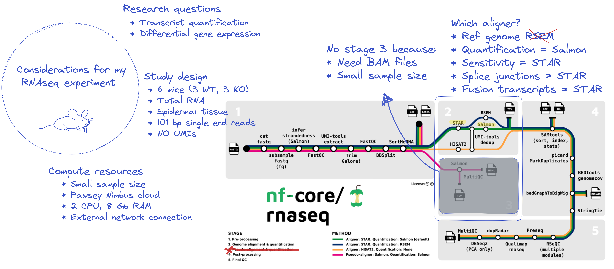

::: {.callout-note}

### **Learning objectives**

- learning outcome 1
- learning outcome 2
  :::

Some intro text to what this lesson is about

### **Sub-section heading**{.unlisted}

Commands should be written like this:

```default
command
```

Where relevant include expected standard output:

```default
stdout here
```

Any important notes for attendees should be present in information boxes. For example:

::: callout-warning

## Copying the code from the grey boxes on training materials

In this workshop we need to copy code from the grey boxes in the training materials and run it in the terminal. If you hover your mouse over a grey box on the website, a clipboard icon will appear on the right side. Click on the clipboard logo to copy the code. Test it out with:

```default
ssh training@###.###.###.###
```

:::

Challenges/activites should be provided in challenge boxes:

::: callout-tip

### **Challenge**{.unlisted}

Question or activity
:::

::: {.callout-caution collapse="true"}

### Solution

Solution explanation and code where relevant

```default

```

:::
For other types of callout blocks see [here](https://quarto.org/docs/authoring/callouts.html). Any figures should be placed in `figs` directory and embeddeded like this:


::: {.callout-note}

### **Key points**

- takeaway 1
- takeaway 2
:::
