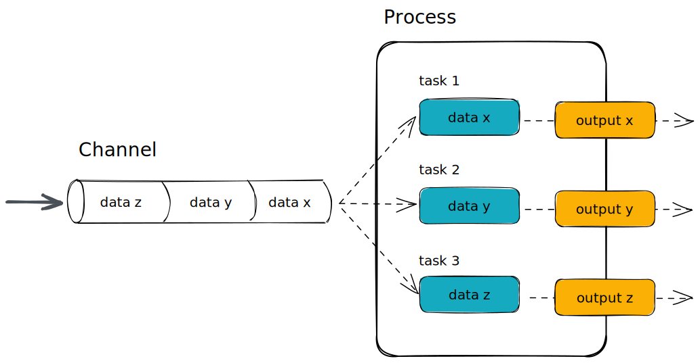

# What is Nextflow? 

{width=100%}

Nextflow is a workflow orchestration engine and domain-specific language (DSL) that makes it easy to write data-intensive computational workflows.

It is designed around the idea that the Linux platform is the lingua franca of data science. Linux provides many simple but powerful command-line and scripting tools that, when chained together, facilitate complex data manipulations.

Nextflow extends this approach, adding the ability to define complex program interactions and a high-level parallel computational environment, based on the dataflow programming model. 

Nextflow’s core features are:

- Workflow portability and reproducibility
- Scalability of parallelization and deployment
- Integration of existing tools, systems, and industry standards

# Processes and Channels

In practice, a Nextflow workflow is made by joining together different processes. Each process can be written in any scripting language that the Linux platform can execute.

Processes are executed independently and are isolated from each other, i.e., they do not share a common (writable) state. They can only communicate via asynchronous first-in, first-out (FIFO) queues, called channels.

Any process can define one or more channels as an input and output. The interaction between these processes, and ultimately the workflow execution flow itself, is implicitly defined by these input and output declarations.



# Execution abstraction

While a process defines what command or script is executed, the executor determines how and where the script is run.

If not specified, processes are executed on your local computer. The local executor is useful for workflow development and testing purposes, however, for real-world computational workflows, a high-performance computing (HPC) or cloud platform is often required.

In other terms, Nextflow provides an abstraction between the workflow’s functional logic and the underlying execution system (or runtime). Thus, it is possible to write a workflow that runs seamlessly on your computer, a cluster, or the cloud without modification.

# Nextflow language

Nextflow implements a declarative domain-specific language (DSL) that simplifies the writing of complex data analysis workflows as an extension of a general-purpose programming language. As a concise DSL Nextflow handles recurrent use cases while having the flexibility and power of a general-purpose programming language to handle corner cases.

Nextflow is an extension of the Groovy programming language which, in turn, is a super-set of the Java programming language. Groovy can be thought of as "Python for Java" and simplifies the code.

# Nextflow CLI

Nextflow provides a robust command line interface for the management and execution pipelines. Nextflow can be used on any POSIX compatible system (Linux, OS X, etc). It requires Bash 3.2 (or later) and Java 11 (or later, up to 18) to be installed.

## Installing Nextflow

Nextflow is distributed as a self-installing package and does not require any special installation procedure. It can be installed using a few easy steps:

1. Download the executable package using either `wget -qO- https://get.nextflow.io | bash` or `curl -s https://get.nextflow.io | bash`
2. Make the binary executable on your system by running `chmod +x nextflow`.
3. Move the `nextflow` file to a directory accessible by your $PATH variable, e.g, `mv nextflow ~/bin/`

A list of `nextflow` options and commands can be viewed using the `-h` option:

``` bash
nextflow -h
```

::: callout-tip
### **Challenge**{.unlisted}

Find out which version of `nextflow` you are using using an option.  
:::

::: {.callout-caution collapse="true"}
### Solution

Print the version of nextflow using the `-v` option: 
```bash
nextflow -v
```
:::

## Environmental variables

You can control the Nextflow runtime and the underlying Java virtual machine using [environment variables](https://www.nextflow.io/docs/latest/config.html#environment-variables). These variables can be exported before running a Nextflow pipeline and will be interpreted as environment variables.

For consistency, it is good practice to pin the version of Nextflow you are using when running a pipeline with the `NXF_VER` variable. 

``` bash
export NXF_VER=<version number>
```

If you are using a shared resource, you may also consider including paths to where software is stored and can be accessed using the `NXF_SINGULARITY_CACHEDIR` or `NXF_CONDA_CACHEDIR` variables.

::: callout-tip
### **Challenge**{.unlisted}

Try pinning the version of `nextflow` you will use to `22.04.5` using the `NXF_VER` environmental variable and check that it has been applied.
:::

::: {.callout-caution collapse="true"}
### Solution

Export the version using the `NXF_VER` environmental variable: 

```bash
export NXF_VER=22.04.5
```

Check that the new version has been applied using the `-v` option:

```bash
nextflow -v
```
:::

You may want to include these in your `.bashrc` (or alternate) that is loaded when you log in so you don’t need to export variables prior to every run.

## Executing a pipeline

The `nextflow run` command is used to initiate the execution of a pipeline script or pull a pipeline project. Nextflow seamlessly integrates with code repositories such as GitHub. This feature allows you to manage your project code consistently and use public Nextflow pipelines quickly and transparently.

When you launch a script with Nextflow, it will look for a file with the pipeline name you’ve specified. If that file does not exist, it will look for a public repository with the same name on GitHub (unless otherwise specified). If it is found, the repository is automatically downloaded to your computer and executed. This repository is stored in the Nextflow home directory, which is, by default, the `$HOME/.nextflow` directory, and will be reused for any further executions.

To launch the execution of a pipeline project, hosted in a remote code repository, you simply need to specify its qualified name or the repository URL after the run command.

The qualified name is formed by two parts - the owner name and the repository name separated by a `/` character. For example, if a Nextflow project is hosted in a GitHub repository at the address `http://github.com/foo/bar`, it can be executed by using:

``` bash
nextflow run foo/bar
```

Alternatively, the complete URL could be used:

``` bash
nextflow run http://github.com/foo/bar
```

If the project is hosted on a service other than GitHub, the hosting service will need to be specified in the command line by using the -hub option. For example, `-hub bitbucket` or `-hub gitlab`. If the complete URL is included the -hub option is not required.


::: callout-tip
### **Challenge**{.unlisted}

Try running `hello` pipeline directly from the `nextflow-io` GitHub account:
:::

::: {.callout-caution collapse="true"}
### Solution

Run the nextflow-io/hello pipeline:

```bash
nextflow run nextflow-io/hello
```
:::

## Pipeline revisions

Running a revision text

::: callout-tip
### **Challenge**{.unlisted}

Try running `hello` pipeline again using the `v1.1` revision:
:::

::: {.callout-caution collapse="true"}
### Solution

Run the nextflow-io/hello pipeline:

```bash
nextflow run nextflow-io/hello -r v1.1
```
:::

If your version of the pipeline is not the latest you may get a warning. 

## Managing your pipelines with nextflow

Over time you might want to remove or update pipelines you have stored locally as assets. You can also manage what pipelines you have stored locally using `nextflow`.

The `list` command prints a list of the projects which are already downloaded into the global cache `$HOME/.nextflow/assets`:

``` bash
nextflow list
```

Pipelines can be removed from your assets using the `drop` command:

``` bash
nextflow drop <pipeline>
```

::: callout-tip
### **Challenge**{.unlisted}

Try to see which pipelines you have stored as assets using `nextflow` and remove the `nextflow-io/hello` pipeline
:::

::: {.callout-caution collapse="true"}
### Solution

List your pipeline assets:

```bash
nextflow list
```

Drop the `nextflow-io/hello` pipeline: 

```bash
nextflow drop nextflow-io/hello
```

Check it has been removed:

```bash
nextflow list
```

:::
