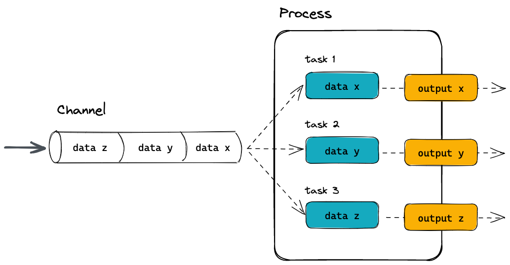

# What is Nextflow?

{width=100%}

Nextflow is a workflow orchestration engine and domain-specific language (DSL) that makes it easy to write data-intensive computational workflows.

It is designed around the idea that the Linux platform is the lingua franca of data science. Linux provides many simple but powerful command-line and scripting tools that, when chained together, facilitate complex data manipulations.

Nextflow extends this approach, adding the ability to define complex program interactions and a high-level parallel computational environment, based on the dataflow programming model. 

Nextflow’s core features are:

- Workflow portability and reproducibility
- Scalability of parallelization and deployment
- Integration of existing tools, systems, and industry standards

Whether you are working with genomics data or other large and complex data sets, Nextflow can help you to streamline your workflow and improve your productivity.

# Processes and Channels

In Nextflow, processes and channels are the fundamental building blocks of a workflow.



A process is a unit of execution that represents a single computational step in a workflow. It is defined as a block of code that typically performs a one specific task and specifies its input and outputs, as well as any parameters, environment settings, and command-line options required for its execution. Processes can be written in any language that can be executed from the command line, such as Bash, Python, or R.

Processes in are executed independently (i.e., they do not share a common writable state) and can run in parallel, allowing for efficient utilization of computing resources. Nextflow automatically manages the data dependencies between processes, ensuring that each process is executed only when its input data is available and all of its dependencies have been satisfied.

A Nextflow workflow is made by joining together different processes using asynchronous first-in, first-out (FIFO) queues called channels. Channels allow data to passed between processes and can be used to manage data dependencies, parallelize tasks, and organize workflows. Any process can define one or more channels as an input and output and the interaction between these processes, and ultimately the workflow execution flow itself, is implicitly defined by these declarations.

Importantly, processes can be parameterized to allow for flexibility in their behavior and to enable reuse of the same process in different parts of the workflow.

# Execution abstraction

While a process defines what command or script is executed, the executor determines how and where the script is run.

Nextflow provides an abstraction between the workflow’s functional logic and the underlying execution system. This abstraction allows users to define a workflow once and run it on different computing platforms without having to modify the workflow definition. Nextflow provides a variety of built-in execution options, such as local execution, HPC cluster execution, and cloud-based execution, and allows users to easily switch between these options using a single command-line argument.

If not specified, processes are executed on your local computer. The local executor is useful for workflow development and testing purposes, however, for real-world computational workflows, a high-performance computing (HPC) or cloud platform is often required.


# Nextflow language

Nextflow implements a declarative domain-specific language (DSL) that simplifies the writing of complex data analysis workflows as an extension of a general-purpose programming language. As a concise DSL Nextflow handles recurrent use cases while having the flexibility and power to handle corner cases.

Nextflow is an extension of the Groovy programming language which, in turn, is a super-set of the Java programming language. Groovy can be thought of as "Python for Java" and simplifies the code.

You do not need to be an expert in Groovy to execute and develop Nextflow workflows. However, if you do want to learn more there are many [great resources](http://groovy-lang.org/documentation.html#languagespecification) available.

# Nextflow command line interface  

Nextflow provides a robust command line interface for the management and execution of workflows. Nextflow can be used on any POSIX compatible system (Linux, OS X, etc). It requires Bash 3.2 (or later) and Java 11 (or later, up to 18) to be installed.

## Installing Nextflow

Nextflow is distributed as a self-installing package and does not require any special installation procedure. If you do not already have Nextflow available on your system it can be installed using a few easy steps:

1. Download the executable package using either `wget -qO- https://get.nextflow.io | bash` or `curl -s https://get.nextflow.io | bash`
2. Make the binary executable on your system by running `chmod +x nextflow`.
3. Move the `nextflow` file to a directory accessible by your $PATH variable, e.g, `mv nextflow ~/bin/`

A list of options and commands can be viewed using the `-h` option:

```bash
nextflow -h
```

::: callout-tip

### **Challenge**{.unlisted}

Find out which version of Nextflow you are using using the version option.  
:::

::: {.callout-caution collapse="true"}

### Solution

Print the version of nextflow using the `-v` option:

```bash
nextflow -v
```

:::

## Environmental variables

You can control the Nextflow runtime and the underlying Java virtual machine using [environment variables](https://www.nextflow.io/docs/latest/config.html#environment-variables). These variables can be exported before running a Nextflow workflow and will be interpreted as environment variables.

For consistency, it is good practice to pin the version of Nextflow you are using when running a workflow using the `NXF_VER` variable.

```bash
export NXF_VER=<version number>
```

Similarly, if you are using a shared resource, you may also consider including paths to where software is stored and can be accessed using the `NXF_SINGULARITY_CACHEDIR` or the `NXF_CONDA_CACHEDIR` variables: 

```bash
export NXF_CONDA_CACHEDIR=<custom/path/to/conda/cache>
```

You may want to include these in your `.bashrc` (or alternate) that is loaded when you log in so you don’t need to export variables every session. A complete list of environmental variables can be found [here](https://www.nextflow.io/docs/latest/config.html#environment-variables).

::: callout-tip

### **Challenge**{.unlisted}

Try pinning the version of `nextflow` you will use to `22.04.5` using the `NXF_VER` environmental variable and check that it has been applied.
:::

::: {.callout-caution collapse="true"}

### Solution

Export the version using the `NXF_VER` environmental variable:

```bash
export NXF_VER=22.04.5
```

Check that the new version has been applied using the `-v` option:

```bash
nextflow -v
```

:::

## Executing a workflow

Nextflow seamlessly integrates with code repositories such as [GitHub](https://github.com/). This feature allows you to manage your project code and use public Nextflow workflows quickly, consistently, and transparently.

The `pull` command will download a workflow from a hosting platform into your global cache `$HOME/.nextflow/assets` folder.

If you are pulling a project hosted in a remote code repository, you can specify its qualified name or the repository URL. The qualified name is formed by two parts - the owner name and the repository name separated by a `/` character. For example, if a Nextflow project (`foo`) is hosted in a GitHub repository (`bar`) at the address `http://github.com/foo/bar`, it could be pulled using:

```bash
nextflow pull foo/bar
```

Or by using the complete URL:

```bash
nextflow pull http://github.com/foo/bar
```

Alternatively, the `clone` command can be used to download a workflow into a local directory of your choice:

```bash
nextflow clone foo/bar <path/to/folder>
```

The Nextflow `run` command is used to initiate the execution of the a workflow script. As well as executing the workflow, the `run` command facilitates rapid iterations, inspections, and debugging of workflows.

```bash
nextflow run foo/bar
```

When you `run` a workflow, it will look for a local file with the workflow name you’ve specified. If that file does not exist, it will look for a public repository with the same name on GitHub (unless otherwise specified). If it is found, Nextflow will automatically `pull` the workflow to your global cache and execute it.

A full list of `run` options can be found [here](https://www.nextflow.io/docs/latest/cli.html#run).

::: callout-tip

### **Challenge**{.unlisted}

Try running the `hello` workflow directly from the `nextflow-io` [GitHub account](https://github.com/nextflow-io/hello):
:::

::: {.callout-caution collapse="true"}

### Solution

Run the [nextflow-io/hello](https://github.com/nextflow-io/hello) workflow:

```bash
nextflow run nextflow-io/hello
```

:::

## workflow revisions

When a nextflow workflow is created or updated, a new revision is created. Each revision is identified by a unique version number, which can be used to track changes made to the workflow and to ensure that the same version of the workflow is used consistently across different runs.

Nextflow provides built-in support for version control using Git, which allows users to easily manage and track changes made to a workflow over time. Users can also specify a specific workflow revision to use when running a workflow, ensuring that the same version of the workflow is used each time.

To use a specific revision, you simply need to add it to the command line with the `--revision` or `-r` flag. For example, to run a workflow with revision `v1.0`, you would use the following command:

A revision can be a git `branch`, `tag` or commit `SHA` number.

Revisions can be 

::: callout-tip

### **Challenge**{.unlisted}

Try running `hello` workflow again using the `v1.1` revision:
:::

::: {.callout-caution collapse="true"}

### Solution

Run the nextflow-io/hello workflow:

```bash
nextflow run nextflow-io/hello -r v1.1
```

:::

If your version of the workflow is not the latest you be shown a warning and will be required to use a revision flag when executing the workflow.

## Managing your workflows

Over time you might want to remove or update workflows you have pulled and are stored locally. You can also manage what workflows you have stored locally using Nextflow.

The `list` command prints a list of the projects which are already downloaded into the global cache `$HOME/.nextflow/assets`:

```bash
nextflow list
```

workflows can be removed from your assets using the `drop` command:

```bash
nextflow drop <workflow>
```

::: callout-tip

### **Challenge**{.unlisted}

Try to see which workflows you have stored as assets using Nextflow and remove the `nextflow-io/hello` workflow
:::

::: {.callout-caution collapse="true"}

### Solution

List your workflow assets:

```bash
nextflow list
```

Drop the `nextflow-io/hello` workflow:

```bash
nextflow drop nextflow-io/hello
```

Check it has been removed:

```bash
nextflow list
```

:::

::: {.callout-note}

### **Key points**

- Nextflow is a workflow orchestration engine and domain-specific language (DSL) that makes it easy to write data-intensive computational workflows.
- Environment variables can be used to control your Nextflow runtime and the underlying Java virtual machine.
- The `pull`, `run`, and `clone` commands can be used to download and store Nextflow workflows.
- The `list` and `drop` can be used to view and remove local workflows.

:::
