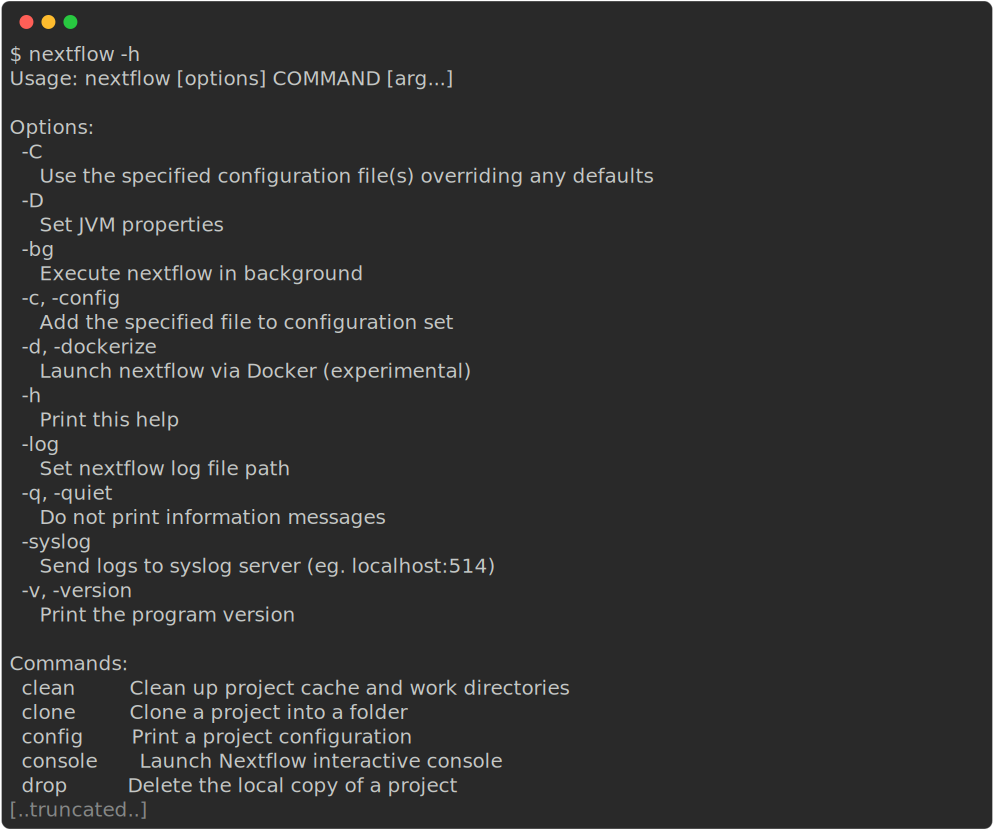
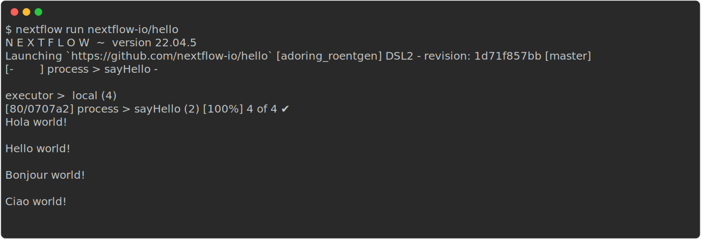
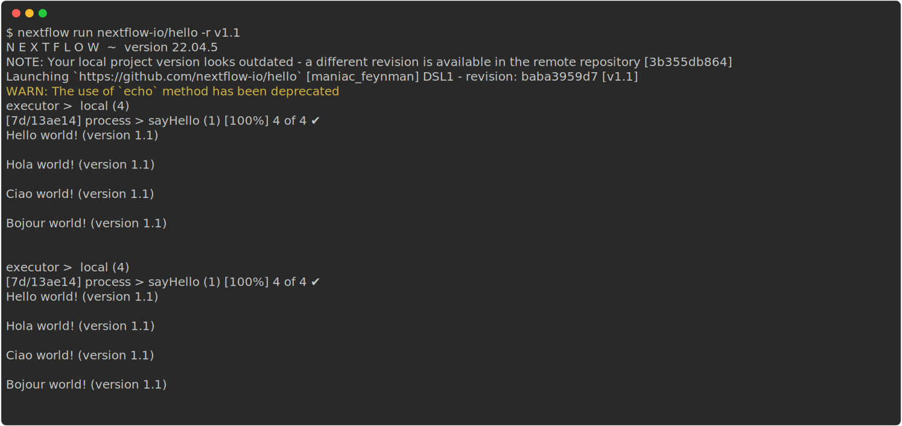
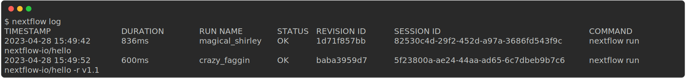
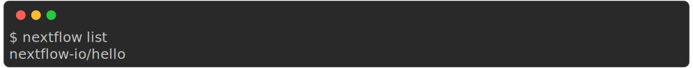

::: callout-tip
### Objectives{.unlisted}

- Point 1
- Point 2
- Point 3

:::

### **1.1.1. What is Nextflow?**

{width=100%}

Nextflow is a workflow orchestration engine and domain-specific language (DSL) that makes it easy to write data-intensive computational workflows.

It is designed around the idea that the Linux platform is the lingua franca of data science. Linux provides many simple but powerful command-line and scripting tools that, when chained together, facilitate complex data manipulations.

Nextflow extends this approach, adding the ability to define complex program interactions and a high-level parallel computational environment, based on the dataflow programming model.

Nextflow’s core features are:

- Workflow portability and reproducibility
- Scalability of parallelization and deployment
- Integration of existing tools, systems, and industry standards

Whether you are working with genomics data or other large and complex data sets, Nextflow can help you to streamline your workflow and improve your productivity.

### **1.1.2. Processes and Channels**

In Nextflow, processes and channels are the fundamental building blocks of a workflow.


A process is a unit of execution that represents a single computational step in a workflow. It is defined as a block of code that typically performs a one specific task and specifies its input and outputs, as well as any directives and conditional statements required for its execution. Processes can be written in any language that can be executed from the command line, such as Bash, Python, or R.

Processes in are executed independently (i.e., they do not share a common writable state) and can run in parallel, allowing for efficient utilization of computing resources. Nextflow automatically manages the data dependencies between processes, ensuring that each process is executed only when its input data is available and all of its dependencies have been satisfied.

A Nextflow workflow is made by joining together different processes using asynchronous first-in, first-out (FIFO) queues called channels. Channels allow data to passed between processes and can be used to manage data, parallelize tasks, and structure workflows. Any process can define one or more channels as an input and output and the interaction between these processes, and ultimately the workflow execution flow itself, is implicitly defined by these declarations.

Importantly, processes can be parameterized to allow for flexibility in their behavior and to enable their reuse in and between workflows.

### **1.1.3. Execution abstraction**

While a process defines what command or script is executed, the executor determines how and where the script is run.

Nextflow provides an abstraction between the workflow’s functional logic and the underlying execution system. This abstraction allows users to define a workflow once and run it on different computing platforms without having to modify the workflow definition. Nextflow provides a variety of built-in execution options, such as local execution, HPC cluster execution, and cloud-based execution, and allows users to easily switch between these options using command-line arguments.

If not specified, processes are executed on your local computer. The local executor is useful for workflow development and testing purposes. However, for real-world computational workflows, a high-performance computing (HPC) or cloud platform is often required.


### **1.1.4. Nextflow CLI**

Nextflow implements a declarative domain-specific language (DSL) that simplifies the writing of complex data analysis workflows as an extension of a general-purpose programming language. As a concise DSL Nextflow handles recurrent use cases while having the flexibility and power to handle corner cases.

Nextflow is an extension of the Groovy programming language which, in turn, is a super-set of the Java programming language. Groovy can be thought of as "Python for Java" and simplifies the code.

Nextflow provides a robust command line interface for the management and execution of workflows. Nextflow can be used on any POSIX compatible system (Linux, OS X, etc). It requires Bash 3.2 (or later) and Java 11 (or later, up to 18) to be installed.

### **1.1.5. Installing Nextflow**

Nextflow is distributed as a self-installing package and does not require any special installation procedure. If you do not already have Nextflow available, it can be installed using a few easy steps:

1. Download the executable package using either `wget -qO- https://get.nextflow.io | bash` or `curl -s https://get.nextflow.io | bash`
2. Make the binary executable on your system by running `chmod +x nextflow`.
3. Move the `nextflow` file to a directory accessible by your `$PATH` variable, e.g, `mv nextflow ~/bin/`

### **1.1.6.Nextflow options and commands**

Nextflow provides a robust command line interface for the management and execution of workflows. The top-level interface consists of options and commands.

A list of options and commands can be viewed using the `-h` option:

```bash
nextflow -h
```



Options for a specific command can also be viewed by appending the help option to a Nextflow command. For example, the `run` command:

```bash
nextflow run -h
```


::: callout-tip

### **Challenge**{.unlisted}

Find out which version of Nextflow you are using using the version option.

:::

::: {.callout-caution collapse="true"}

### Solution

The version of Nextflow you are using can be printed using the `-v` option:

```bash
nextflow -v
```


:::

### **1.1.7. Managing your environment**

You can use [environment variables](https://www.nextflow.io/docs/latest/config.html#environment-variables) to control the Nextflow runtime and the underlying Java virtual machine. These variables can be exported before running a workflow and will be interpreted by Nextflow. For most users, Nextflow will work without setting any environment variables. 

However, for consistency, it is good practice to pin the version of Nextflow you are using when running a workflow using the `NXF_VER` variable:

```bash
export NXF_VER=<version number>
```

::: callout-tip

### **Challenge**{.unlisted}

Pin the version of Nextflow to `22.04.5` using the `NXF_VER` environmental variable and check that it has been applied.

:::

::: {.callout-caution collapse="true"}

### Solution

Export the version using the `NXF_VER` environmental variable:

```bash
export NXF_VER=22.04.5
```

Check that the new version has been applied using the `-v` option:

```bash
nextflow -v
```


:::

Similarly, if you are using a shared resource, you may also consider including paths to where software is stored and can be accessed using the `NXF_SINGULARITY_CACHEDIR` or the `NXF_CONDA_CACHEDIR` variables:

```bash
export NXF_CONDA_CACHEDIR=<custom/path/to/conda/cache>
```

::: callout-tip

### **Challenge**{.unlisted}

Create a new folder with the path `/home/training/singularity_cache` to store your singularity images and export its location using the `NXF_SINGULARITY_CACHEDIR` environmental variable:

:::

::: {.callout-caution collapse="true"}

### Solution

Make a new folder for your singularity images:

```bash
mkdir /home/training/singularity_cache
```

Export your new folder as your cache directory for singularity images using the `NXF_SINGULARITY_CACHEDIR` environmental variable:

```bash
export NXF_SINGULARITY_CACHEDIR=/home/training/singularity_cache
```

:::

You may want to include these, or other environmental variables, in your `.bashrc` file (or alternate) that is loaded when you log in so you don’t need to export variables every session. A complete list of environmental variables can be found [here](https://www.nextflow.io/docs/latest/config.html#environment-variables).

### **1.1.8. Executing a workflow**

Nextflow seamlessly integrates with code repositories such as [GitHub](https://github.com/). This feature allows you to manage your project code and use public Nextflow workflows quickly, consistently, and transparently.

The Nextflow `pull` command will download a workflow from a hosting platform into your global cache `$HOME/.nextflow/assets` folder.

If you are pulling a project hosted in a remote code repository, you can specify its qualified name or the repository URL. The qualified name is formed by two parts - the owner name and the repository name separated by a `/` character. For example, if a Nextflow project `foo` is hosted in a GitHub repository `bar` at the address `http://github.com/foo/bar`, it could be pulled using:

```bash
nextflow pull foo/bar
```

Or by using the complete URL:

```bash
nextflow pull http://github.com/foo/bar
```

Alternatively, the Nextflow `clone` command can be used to download a workflow into a local directory of your choice:

```bash
nextflow clone foo/bar <your/path>
```

The Nextflow `run` command is used to initiate the execution of a workflow :

```bash
nextflow run foo/bar
```

It is worth noting that you `run` a workflow, it will look for a local file with the workflow name you’ve specified. If that file does not exist, it will look for a public repository with the same name on GitHub (unless otherwise specified). If it is found, Nextflow will automatically `pull` the workflow to your global cache and execute it.

::: callout-tip

### **Challenge**{.unlisted}

Try to `run` the `hello` workflow directly from `nextflow-io` [GitHub](https://github.com/nextflow-io/hello).
:::

::: {.callout-caution collapse="true"}

### Solution

Run the [nextflow-io/hello](https://github.com/nextflow-io/hello) workflow:

```bash
nextflow run nextflow-io/hello
```



:::

A full list of Nextflow `run` options can be found [here](https://www.nextflow.io/docs/latest/cli.html#run).

### **1.1.9. Executing a revision**

When a Nextflow workflow is created or updated, a new revision is created. Each revision is identified by a unique number, which can be used to track changes made to the workflow and to ensure that the same version of the workflow is used consistently across different runs.

The Nextflow `info` command can be used to view workflow properties, such as the project name, repository, local path, main script, and revisions. The `*` indicates which revision of the workflow you have stickied and will be executed when using the `run` command.

```bash
nextflow info <workflow>
```

To use a specific revision, you simply need to add it to the command line with the `--revision` or `-r` flag. For example, to run a workflow with the `v1.0` revision, you would use the following command:

```bash
nextflow run <workflow> -r v1.0
```

Nextflow provides built-in support for version control using Git, which allows users to easily manage and track changes made to a workflow over time. A revision can be a git `branch`, `tag` or commit `SHA` number.

::: callout-tip

### **Challenge**{.unlisted}

Try to run the `hello` workflow directly from `nextflow-io` GitHub using the `v1.1` revision tag.
:::

::: {.callout-caution collapse="true"}

### Solution

Run the `nextflow-io/hello` workflow with the revision `-r` option:

```bash
nextflow run nextflow-io/hello -r v1.1
```



:::

If your local version of a workflow is not the latest you be shown a warning and will be required to use a revision flag when executing the workflow. You can update a workflow with the Nextflow `pull` command.

> It is recommended that you use the revision flag every time you execute a workflow to ensure that the version is correct.

### **1.1.10. Nextflow log**

It is important to keep a record of the commands you have run to generate your results. Nextflow helps with this by creating storing metadata and logs about the run in hidden files and folders in your current directory (unless otherwise specified). While this data can be used by Nextflow to generate reports, the metadata can also be queried using the Nextflow `log` command:

```bash
nextflow log
```

This command contains multiple options to facilitate the queries and is especially useful while debugging a pipeline and while inspecting pipeline execution metadata. You can view all of the possible `log` options with `-h` flag:

```bash
nextflow log -h
```

To query a specific execution you can use the `RUN NAME` or a `SESSION ID`:

```bash
nextflow log <run name>
```

To get more information, you can use the `-f` option with named fields. For example:

```bash
nextflow log <run name> -f 'process,hash,duration'
```

You can view a full list of fields with the `-l` option:

```bash
nextflow log -l
```

::: callout-tip

### **Challenge**{.unlisted}

View the `process`, `hash`, and `script` for your tasks from your most recent Nextflow execution.

:::

::: {.callout-caution collapse="true"}

### Solution

Use the `log` command to get a list of you recent executions:

```bash
nextflow log
```



Query the process, hash, and script using the `-f` option for the most recent run:

```bash
nextflow log crazy_faggin -f 'process,hash,script'
```


:::

### **1.1.10. Listing and dropping workflows**

Over time you might want to remove a stored workflows. Nextflow also has functionality to help you to view and remove workflows that have been pulled locally.

The Nextflow `list` command prints the projects stored in your global cache `$HOME/.nextflow/assets`. These are the workflows that were pulled when you executed either of the Nextflow `pull` or `run` commands:

```bash
nextflow list
```



If you want to remove a workflow from your cache you can remove it using the Nextflow `drop` command:

```bash
nextflow drop <workflow>
```

::: callout-tip

### **Challenge**{.unlisted}

`list` your stored workflows and the remove them with the `drop` command.
:::

::: {.callout-caution collapse="true"}

### Solution

List your workflow assets:

```bash
nextflow list
```

Drop the `nextflow-io/hello` workflow:

```bash
nextflow drop nextflow-io/hello
```

Check it has been removed:

```bash
nextflow list
```

:::

### **1.1.11. Execution cache and resume**

The `Sydney-Informatics-Hub/nf-core-demo` pipeline was created with the nf-core tools `create` command. Out of the box, it comprises four processes:

1. `SAMPLESHEET_CHECK`
   1. Checks the sample sheet is valid using a custom python script.
2. `FASTQC`
   1. Runs `fastqc` on the fastq files listed in the samplesheet.
3. `CUSTOM_DUMPSOFTWAREVERSIONS`
   1. Curates a list of software used in the pipeline.
4. `MULTIQC`
   1. Runs MultiQC with the fastqc reports and software list.

It can be run using the following command:

```bash
nextflow run Sydney-Informatics-Hub/nf-core-demo -profile test,singularity --outdir my_results
```

In this example, the `test` and `singularity` profiles are used to configure the pipeline 

Nextflow has a caching mechanism that works by assigning a unique ID to each task. The task unique ID is generated as a 128-bit hash value composing the task input values, files, and command string, and is used to create a separate execution directory where the tasks are executed and the results stored.

::: {.callout-note}

### **Key points**

- Nextflow is a workflow orchestration engine and domain-specific language (DSL) that makes it easy to write data-intensive computational workflows.
- Environment variables can be used to control your Nextflow runtime and the underlying Java virtual machine.
- Nextflow supports version control and has automatic integrations with online code repositories.
- You can manage workflows with Nextflow commands (e.g., `pull`, `clone`, `list`, and `drop`).

:::
