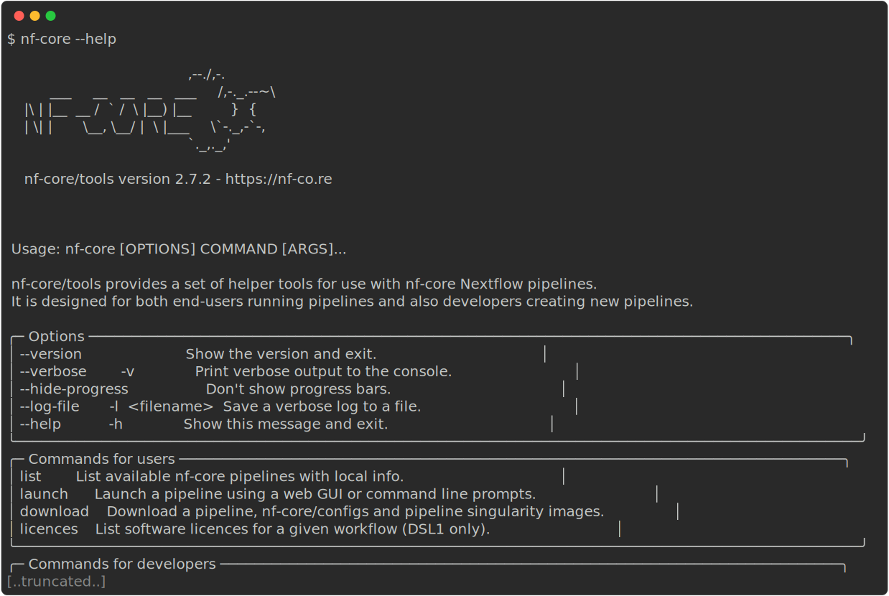

::: callout-tip
### Objectives{.unlisted}

- Point 1
- Point 2
- Point 3

:::

### **1.2.1. What is nf-core?**

{width=100%}

nf-core is a community effort to collect a curated set of analysis workflows built using Nextflow.

nf-core provides a standardized set of best practices, guidelines, and templates for building and sharing bioinformatics workflows. These workflows are designed to be modular, scalable, and portable, allowing researchers to easily adapt and run them using their own data and compute resources.

The nf-core community comprises a diverse group of bioinformaticians, developers, and researchers from around the world who collaborate on developing and maintaining a growing collection of high-quality workflows. These workflows cover a range of applications, including transcriptomics, proteomics, and metagenomics.

One of the key benefits of nf-core is that it promotes open development, testing, and peer review, ensuring that the workflows are robust, well-documented, and validated against real-world datasets. This helps to increase the reliability and reproducibility of bioinformatics analyses and ultimately enables researchers to accelerate their scientific discoveries.

nf-core is published in Nature Biotechnology: [Nat Biotechnol 38, 276–278 (2020). Nature Biotechnology](https://www.nature.com/articles/s41587-020-0439-x)

**Key Features of nf-core workflows**

- **Documentation**
  - nf-core workflows have extensive documentation covering installation, usage, and description of output files to ensure that you won't be left in the dark.
- **CI Testing**
  - Every time a change is made to the workflow code, nf-core workflows use continuous-integration testing to ensure that nothing has broken.
- **Stable Releases**
  - nf-core workflows use GitHub releases to tag stable versions of the code and software, making workflow runs totally reproducible.
- **Packaged software**
  - Pipeline dependencies are automatically downloaded and handled using Docker, Singularity, Conda, or other software management tools. There is no need for any software installations.
- **Portable and reproducible**
  - nf-core workflows follow best practices to ensure maximum portability and reproducibility. The large community makes the workflows exceptionally well-tested and easy to run.
- **Cloud-ready**
  - nf-core workflows are tested on AWS after every major release. You can even browse results live on the website and use outputs for your own benchmarking.

It is important to remember all nf-core workflows are open-source and community driven. Most pipelines are under active community development and are regularly updated with fixes and other improvements. Even though the pipelines and tools undergo repeated community review and testing - it is important to check your results.

### **1.2.2. Events**

nf-core events are community-driven gatherings that provide a platform to discuss the latest developments in Nextflow and nf-core workflows. These events include community seminars, trainings, and hackathons, and are open to anyone who is interested in using and developing nf-core and its applications. Most events are held virtually, making them accessible to a global audience.

Upcoming events are listed on the [nf-core event page](https://nf-co.re/events) and announced on [Slack](https://nf-co.re/join/slack) and [Twitter](https://twitter.com/nf_core).

### **1.2.3. Join the community!**

There are several ways you can join the nf-core community. You are welcome to join any or all of these at any time!

::: {layout-ncol=5 layout-valign="center"}

[](https://nf-co.re/join/slack)

[](https://github.com/nf-core)

[](https://twitter.com/nf_core)

[](https://mstdn.science/@nf_core)

[](https://www.youtube.com/c/nf-core)

:::

Joining the nf-core Slack can be especially useful for users. There are dedicated channels for all workflows as well as channels for common topics. If you are unsure of where to ask you questions - the `#help` and `#nostupidquestions` channels are a great place to start.

:wave: If you are joining the nf-core Slack for the first time make sure you drop a message in `#say-hello` to introduce yourself!

> If you have questions about Nextflow and deployments that are not related to nf-core you can ask them on the [Nextflow Slack](https://www.nextflow.io/blog/2022/nextflow-is-moving-to-slack.html). It's worthwhile joining both Slack groups and browsing the channels to get an idea of what types of questions are being asked on each channel. Searching channels can also be a great source of information as your question may have been asked before.

### **1.2.4. nf-core tooling**

This workshop will make use of nf-core tools, a set of helper tools for use with Nextflow workflows. These tools have been developed to provide a range of additional functionality using, developing, and testing workflows.

nf-core tools is written in Python and is available from the [Python Package Index (PyPI)](https://pypi.org/project/nf-core/):

```bash
pip install nf-core
```

Alternatively, nf-core tools can be installed from [Bioconda](https://anaconda.org/bioconda/nf-core):

```bash
conda install -c bioconda nf-core
```

You can nf-core `--version` options can be used to print your version of nf-core tools:

```bash
nf-core --version
```

::: callout-tip

### **Challenge**{.unlisted}

Find out what version of nf-core tools you have available using the nf-core `--version` option:

:::

::: {.callout-caution collapse="true"}

### Solution

Use the nf-core `--version` option to print the nf-core tools version:

```bash
nf-core --version
```


:::

nf-core tools is for everyone and has commands to help both users and developers. For users, the tools make it easier to run workflows. For developers, the tools make it easier to develop and test your workflows using best practices.

::: callout-tip

### **Challenge**{.unlisted}

Find out what other nf-core tools options and commands are available using the `--help` option:

:::

::: {.callout-caution collapse="true"}

### Solution

Run the `--help` option to list the options, tools for users, and tools for developers

```bash
nf-core --help
```



:::

### **1.2.5. Running an nf-core workflow**

There are currently 80 workflows (March 2023) available as part of nf-core. These workflows are at various stages of development with 49 released, 19 under development, and 12 archived.

The [nf-core website](https://nf-co.re/) has a full list of workflows, as well as their documentation, which can be explored.

Each workflow has a dedicated page that includes expansive documentation that is split into 7 sections:

- Introduction
  - An introduction and overview of the workflow
- Results
  - Example output files generated from the full test dataset
- Usage docs
  - Descriptions of how to run the workflow
- Parameters
  - Grouped workflow parameters with descriptions
- Output docs
  - Descriptions and examples of the expected output files
- Releases & Statistics
  - Workflow version history and statistics

Unless you are actively developing workflow code, you do not need to clone the workflow code from GitHub and can use Nextflow’s built-in functionality to `pull` and a workflow. As shown in the [Introduction to Nextflow](1.1_nextflow.md#executing-a-workflow), the Nextflow `pull` command can download and cache nf-core workflows from the [nf-core GitHub](https://github.com/nf-core/) repository:

```bash
nextflow pull nf-core/<pipeline>
```

Nextflow `run` will also automatically `pull` the workflow if it was not already available locally:

```bash
nextflow run nf-core/<pipeline>
```

Nextflow will `pull` the default git branch if a workflow version is not specified. This will be the master branch for nf-core workflows with a stable release. nf-core workflows use GitHub releases to tag stable versions of the code and software. You will always be able to run a previous version of a workflow once it is released using the `-revision` or `-r` flag.

::: callout-tip

### **Challenge**{.unlisted}

Try to `pull` the latest version of the `nf-core/rnaseq` workflow directly from GitHub using Nextflow:

:::

::: {.callout-caution collapse="true"}

### Solution

Use the Nextlfow `pull` command to download the `rnaseq` workflow from the `nf-core` GitHub repository.

```bash
nextflow pull nf-core/rnaseq
```


:::

::: {.callout-note}

### **Key points**

- Point 1
- Point 2
- Point 3

:::
