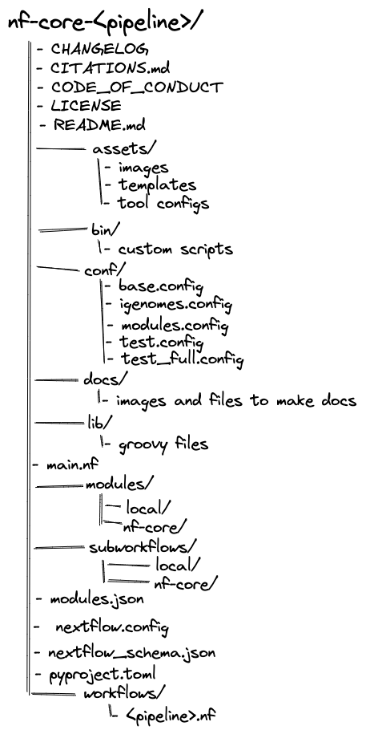

nf-core workflows follow a set of best practices and standardized conventions. nf-core workflows start from a common template and follow the same structure. Although you won’t need to edit code in the workflow project directory, having a basic understanding of the project structure will help you understand how to configure its execution.



To make workflows flexible and organized, the parameters used to configure nf-core workflows are stored in different files in different locations. Notably, while some of these files are included in the nf-core repository by default (e.g., `nextflow.config`), others are external to the code base and are included using `run` options (e.g., `-params-file`, and `-c`).

# Viewing parameters

Every nf-core workflow has a full list and description of parameters on the nf-core website. Some parameters will also have additional help text to help you understand when and how a parameter should be used.

Parameters and their descriptions can also be viewed in the command line using the `run` command with the `--help` parameter:

``` bash
nextflow run nf-core/<workflow> --help
```

::: callout-tip

### **Challenge**{.unlisted}

View the parameters for the nf-core/rnaseq pipeline.

:::

::: {.callout-caution collapse="true"}

### Solution

Parameters for the nf-core/rnaseq workflow can be printed using the `--help` option:

```bash
nextflow run nf-core/rnaseq --help 
```

:::

# Configuration hierarchy

When a workflow is launched, Nextflow will look for configuration files in several locations. As each configuration file can contain conflicting settings, the sources are ranked to decide which settings to are applied. Configuration sources are reported below and listed in order of priority:

1. Parameters specified on the command line (`--parameter`)
2. Parameters that are provided using the `-params-file` option
3. Config file specified using the `-c` option
4. The config file named `nextflow.config` in the current directory
5. The config file named `nextflow.config` in the workflow project directory
6. The config file `$HOME/.nextflow/config`
7. Values defined within the workflow script itself (e.g., `main.nf`)

## Command line parameters

At the highest level, parameters can be customized at execution using the command line. Any parameter can be specified on the command line by prefixing the parameter name with two dashs (`--`):

```bash
nextflow nf-core/<workflow> --<parameter>
```

::: callout-tip

While Nextflow options are prefixed with a single dash (`-`) all workflow parameters are prefixed with a double dash (`--`).

:::

## Default configuration settings

All parameters will have a default setting that is defined using the `nextflow.config` file in the workflow project directory.

Notably, several `includeConfig` statements in the `nextflow.config` file are used to include additional `.config` files from the `conf/` folder. Each additional `.config` file contains categorized configuration information for your workflow execution, some of which can be optionally included:

- `base.config`
  - Included by default.
  - Generous resource allocations using labels.
  - Does not specify any method for software management and expects software to be available (or specified elsewhere).
- `igenomes.config`
  - Included by default.
  - Default configuration to access reference files stored on AWS iGenomes.
- `modules.config`
  - Included by default.
  - Module-specific configuration options (both mandatory and optional).
- `test.config`
  - Only included if specified as a profile.
  - A configuration profile to test the workflow with a small test dataset.
- `test_full.config`
  - Only included if specified as a profile.
  - A configuration profile to test the workflow with a full-size test dataset.

Configuration files can also contain the definition of one or more profiles. A profile is a set of configuration attributes that can be activated when launching a workflow by using the `-profile` command option:

```bash
nextflow run nf-core/<workflow> -profile <profile>
```

Profiles used by nf-core workflows include:

- Software management profiles
  - Profiles for the management of software using software management tools, e.g., `docker`, `singularity`, and `conda`.
- Test profiles
  - Profiles to execute the workflow with a standardized set of test data and parameters, e.g., `test` and `test_full`.

Multiple profiles can be specified in a comma-separated list when you execute your command. The order of profiles is important as they will be read from left to right:

```bash
nextflow run nf-core/<workflow> -profile test,docker
```

By default, nf-core workflows are required to define software containers and conda environments that can be activated using profiles. Although it is possible to run the workflows with software installed by other methods (e.g., environment modules or manual installation), most users find that Docker and Singularity are the most convenient and reproducible.

## Shared configs

An `includeConfig` statement in the `nextflow.config` file is also used to include custom institutional profiles that have been submitted to the nf-core [config repository](https://github.com/nf-core/configs). At run time, nf-core workflows will fetch these configuration profiles from the remote configs repository and make them available.

For shared resources such as an HPC cluster, you may consider developing a shared institutional profile. You can follow [this tutorial](https://nf-co.re/docs/usage/tutorials/step_by_step_institutional_profile) for more help.

## Local configuration files

Nextflow will look for local configuration files that are external to the workflow project directory:

- Your home directory: `~/.nextflow/config`
- Your working directory: `nextflow.config`
- Custom paths specified on the command line: `-c <path/to/config>` or `-params-file <path/to/config>`

### Paramteter files

Parameter files are `.json` that can contain an unlimited number of parameters:

```bash
{
   "<parameter1_name>": 1,
   "<parameter2_name>": "<string>",
   "<parameter3_name>": true
}
```

You can override default parameters by creating a custom `.json` file and passing it as a command-line argument using the `-param-file` option.

``` bash
nextflow run nf-core/<workflow> -profile test,docker -param-file <path/to/myparams.json>
```

### Config files

Although these `.config` files are already being used to set defaults you can override them using a custom `.config` file and passing it as a command-line argument using the `-c` option.

```bash
nextflow run nf-core/<workflow> -profile test,docker -c custom.config
```

Configuration settings are organized into scopes by dot prefixing the property names with a scope identifier or grouping the properties in the same scope using the curly brackets notation. For example:

```bash
alpha.x  = 1
alpha.y  = 'string value..'
```

Is equivalent to:

```bash
alpha {
     x = 1
     y = 'string value..'
}
```

Importantly, the `process` scope allows you to configure workflow processes.

Modules in nf-core workflows make use of labels. By default, process resources are allocated in the `conf/base.config` file using the `withLabel` selector. For example:

```bash
process {
    withLabel: big_mem {
        cpus = 16
        memory = 64.GB
    }
}
```

Similarly, the `withName` selector allows the configuration of a specific process by its name. By default, module parameters are defined in the `conf/modules.config` file. For example:

```bash
process {
    withName: HELLO {
        cpus = 4
        memory = 8.GB
    }
}
```

Most tool arguments are defined in the `conf/modules.conf` file in the workflow code under the `ext.args` entry.

For example, if you were trying to overwrite arguments in the `TRIMGALORE` process in the `nf-core/rnaseq` workflow you could use the process scope:

```bash
process {
    withName : ".*:TRIMGALORE" {
        ext.args   = { "<your custom parameter>" }
    }
```

However, in other cases, a workflow may use a tool multiple times in the workflow and you will need to specify an extended execution path of the module. For example:

```bash
process {
    withName: "NFCORE_RNASEQ:RNASEQ:FASTQ_FASTQC_UMITOOLS_TRIMGALORE:TRIMGALORE" {
        ext.args = "<your custom parameter>"
    }
}
```

::: callout-warning

A `-params-file` must be used to define parameters.

Parameters that are defined in the parameter block in `custom.config` files **WILL NOT** override defaults in `nextflow.config` for nf-core workflows.

:::

A full list of configuration scopes can be found [here](https://www.nextflow.io/docs/latest/config.html#config-scopes).