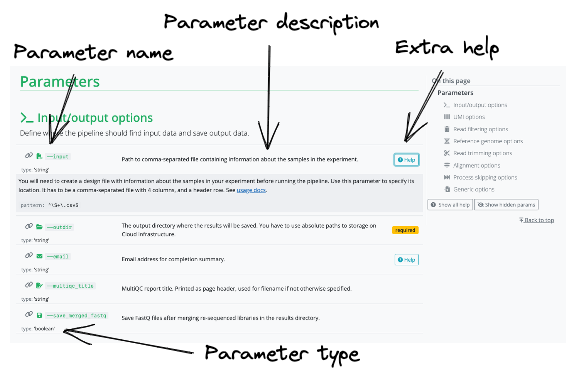
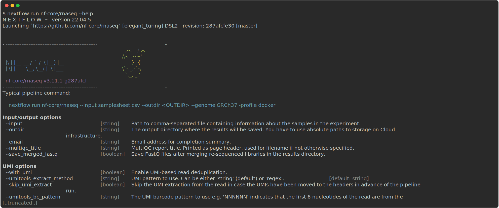

{width=100%}

nf-core workflows follow a set of best practices and standardized conventions. nf-core workflows start from a common template and follow the same structure. Although you won’t need to edit code in the workflow project directory, having a basic understanding of the project structure will help you understand how to configure its execution and where files of interest are located.


Notably, while some of these files are already included in the nf-core workflow repository (e.g., the `nextflow.config` file in the nf-core workflow repository), others are automatically identified on your local system (e.g., the `nextflow.config` in the launch directory), and others are only included if they are specified using `run` options (e.g., `-params-file`, and `-c`).

# Viewing parameters

Every nf-core workflow has a full list of parameters on the nf-core website. You will also be shown a description of the parameter as well as the type. Some parameters will also have additional text to help you understand when and how a parameter should be used.

[{width=80%}](https://nf-co.re/rnaseq/3.11.1/parameters)

For nf-core workflows, parameters and their descriptions can also be viewed in the command line using the `run` command with the `--help` parameter:

```bash
nextflow run nf-core/<workflow> --help
```

::: callout-tip

### **Challenge**{.unlisted}

Try to view the parameters for the `nf-core/rnaseq` pipeline:

:::

::: {.callout-caution collapse="true"}

### Solution

Parameters for the nf-core/rnaseq workflow can be printed using the `--help` option:

```bash
nextflow run nf-core/rnaseq --help
```

{width=100%}

:::

# Configuration hierarchy

When a workflow is launched, Nextflow will look for configuration files in several locations. As each configuration file can contain conflicting settings, the sources are ranked to decide which settings to are applied. Configuration sources are reported below and listed in order of priority:

1. Parameters specified on the command line (`--parameter`)
2. Parameters that are provided using the `-params-file` option
3. Config file that are provided using the `-c` option
4. The config file named `nextflow.config` in the current directory
5. The config file named `nextflow.config` in the workflow project directory
6. The config file `$HOME/.nextflow/config`
7. Values defined within the workflow script itself (e.g., `main.nf`)

For example, the default parameter parameter value that is included in the config file named `nextflow.config` in the workflow project directory can be overwritten using the command line.

## Command line parameters

At the highest level, parameters can be customized at execution using the command line. Any parameter can be specified on the command line by prefixing the parameter name with a double dash (`--`):

```bash
nextflow nf-core/<workflow> --<parameter>
```

::: callout-tip

While Nextflow options are prefixed with a single dash (`-`) all workflow parameters are prefixed with a double dash (`--`).

:::

## Default configuration

All parameters will have a default setting that is defined using the `nextflow.config` file in the workflow project directory.

There are also several `includeConfig` statements in the `nextflow.config` file that are used to include additional `.config` files from the `conf/` folder. Each additional `.config` file contains categorized configuration information for your workflow execution, some of which can be optionally included:

- `base.config`
  - Included by default.
  - Generous resource allocations using labels.
  - Does not specify any method for software management and expects software to be available (or specified elsewhere).
- `igenomes.config`
  - Included by default.
  - Default configuration to access reference files stored on AWS iGenomes.
- `modules.config`
  - Included by default.
  - Module-specific configuration options (both mandatory and optional).
- `test.config`
  - Only included if specified as a profile.
  - A configuration profile to test the workflow with a small test dataset.
- `test_full.config`
  - Only included if specified as a profile.
  - A configuration profile to test the workflow with a full-size test dataset.

Notably, configuration files can also contain the definition of one or more profiles. A profile is a set of configuration attributes that can be activated when launching a workflow by using the `-profile` command option:

```bash
nextflow run nf-core/<workflow> -profile <profile>
```

Profiles used by nf-core workflows include:

- Software management profiles
  - Profiles for the management of software using software management tools, e.g., `docker`, `singularity`, and `conda`.
- Test profiles
  - Profiles to execute the workflow with a standardized set of test data and parameters, e.g., `test` and `test_full`.

Multiple profiles can be specified in a comma-separated list when you execute your command. The order of profiles is important as they will be read from left to right:

```bash
nextflow run nf-core/<workflow> -profile test,singularity
```

By default, nf-core workflows are required to define software containers and conda environments that can be activated using profiles. Although it is possible to run the workflows with software installed by other methods (e.g., environment modules or manual installation), most users find that Docker and Singularity are most convenient and reproducible.

## Shared configs

An `includeConfig` statement in the `nextflow.config` file is also used to include custom institutional profiles that have been submitted to the nf-core [config repository](https://github.com/nf-core/configs). At run time, nf-core workflows will fetch these configuration profiles from the remote configs repository and make them available.

For shared resources such as an HPC cluster, you may consider developing a shared institutional profile. You can follow [this tutorial](https://nf-co.re/docs/usage/tutorials/step_by_step_institutional_profile) for more help.

## Custom configuration files

Nextflow will also look for custom configuration files that are external to the workflow project directory. These files include:

- The config file `$HOME/.nextflow/config`
- A config file named `nextflow.config` in the current directory
- Custom files specified using the command line
  - A parameter file that is provided using the `-params-file` option
  - A config file that are provided using the `-c` option

You can be clever with the what settings you configure in each of these files.

For example, you might consider configuring settings that are unique to you as a user (such as your name and email address) in your home directory as this will be applied to every execution.

### Paramteter files

Parameter files are `.json` files that can contain an unlimited number of parameters:

```bash
{
   "<parameter1_name>": 1,
   "<parameter2_name>": "<string>",
   "<parameter3_name>": true
}
```

You can override default parameters by creating a custom `.json` file and passing it as a command-line argument using the `-param-file` option.

```bash
nextflow run nf-core/<workflow> -profile test,docker -param-file <path/to/params.json>
```

### Configuration files

Configuration files are `.config` files that can contain various workflow properties.

Custom paths passed in the command-line using the `-c` option:

```bash
nextflow run nf-core/<workflow> -profile test,docker -c <path/to/custom.config>
```

Multiple custom `.config` files can be included at execution by separating them with a comma (`,`).

Custom configuration files follow the same structure as the configuration file included in the workflow directory. Configuration properties are organized into [scopes](https://www.nextflow.io/docs/latest/config.html#config-scopes) by dot prefixing the property names with a scope identifier or grouping the properties in the same scope using the curly brackets notation. For example:

```bash
alpha.x  = 1
alpha.y  = 'string value..'
```

Is equivalent to:

```bash
alpha {
     x = 1
     y = 'string value..'
}
```

Scopes allow you to quickly configure settings required to deploy a workflow on different infrastructure using different software management. For example, the `executor` scope can be used to provide settings for the deployment of a workflow on a HPC cluster and the `singularity` scope controls how Singularity containers are executed by Nextflow. Multiple scopes can be included in the same `.config` file using a mix of dot prefixes and curly brackets. A full list of scopes is described in detail [here](https://www.nextflow.io/docs/latest/config.html#config-scopes).

Importantly, the `process` scope allows you to configure workflow processes and is used extensively to define resources and additional arguments for modules.

By default, process resources are allocated in the `conf/base.config` file using the `withLabel` selector:

```bash
process {
    withLabel: BIG_MEM {
        cpus = 16
        memory = 64.GB
    }
}
```

Similarly, the `withName` selector enables the configuration of a process by name. By default, module parameters are defined in the `conf/modules.config` file:

```bash
process {
    withName: HELLO {
        cpus = 4
        memory = 8.GB
    }
}
```

While some tool arguments are included as a part of a module. To make modules sharable across workflows, most tool arguments are defined in the `conf/modules.conf` file in the workflow code under the `ext.args` entry.

For example, if you were trying to overwrite arguments in the `TRIMGALORE` process in the `nf-core/rnaseq` workflow, you could use the process scope:

```bash
process {
    withName : ".*:TRIMGALORE" {
        ext.args   = { "<your custom parameter>" }

    }
```

However, as the `TRIMGALORE` process is used multiple times in this workflow, an extended execution path of the module is required to make it more specific:

```bash
process {
    withName: "NFCORE_RNASEQ:RNASEQ:FASTQ_FASTQC_UMITOOLS_TRIMGALORE:TRIMGALORE" {
        ext.args = "<your custom parameter>"
    }
}
```

The extended execution path is built from the workflows, subworkflows, and modules used to execute the process.

In the example above, the nf-core [`TRIMGALORE`](https://github.com/nf-core/rnaseq/blob/master/modules/nf-core/trimgalore/main.nf) module, was called by the [`FASTQ_FASTQC_UMITOOLS_TRIMGALORE`](https://github.com/nf-core/rnaseq/blob/master/subworkflows/nf-core/fastq_fastqc_umitools_trimgalore/main.nf) subworkflow, which was called by the [`RNASEQ`](https://github.com/nf-core/rnaseq/blob/master/workflows/rnaseq.nf) workflow, which was called by the [`NFCORE_RNASEQ`](https://github.com/nf-core/rnaseq/blob/master/main.nf) workflow in the [`main.nf`](https://github.com/nf-core/rnaseq/blob/master/main.nf) file in the [`nf-core/rnaseq`](https://github.com/nf-core/rnaseq) repository.

::: callout-tip

If you are unsure of how to build the execution path you can copy it from the `conf/modules.conf` file.

:::

::: callout-warning

A `-params-file` **MUST** be used to define workflow parameters.

Parameters that are defined in the parameter block in `custom.config` files **WILL NOT** override defaults in `nextflow.config` for nf-core workflows.

:::

::: {.callout-note}

### **Key points**

- Point 1
- Point 2
- Point 3

:::