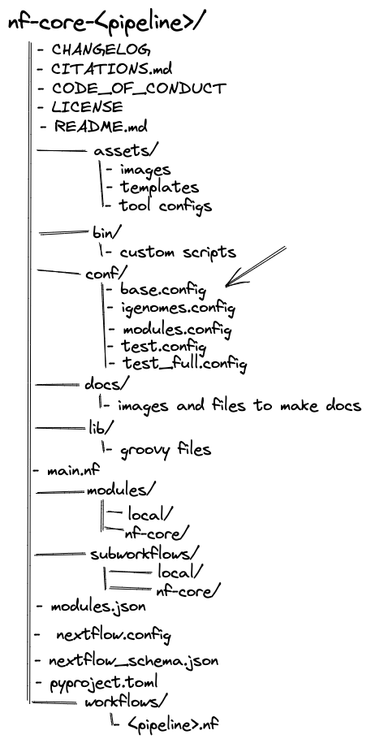

nf-core pipelines follow a set of best practices and standardized conventions. The structure of an nf-core pipeline is designed to be modular, easily customizable, and reproducible. Although you won’t need to edit the code base to run an nf-core pipeline, having a basic understanding of the repository structure will help you understand how to configure its execution.

# Workflow Configuration

When a workflow is launched, Nextflow will look for configuration files in multiple locations. As each configuration file can contain conflicting settings, the sources are ranked to decide which settings to are applied.

Configuration sources are reported below and listed in order of priority:

1. Parameters specified on the command line (`--parameter`)
2. Parameters that are provided using the `-params-file` option
3. Config file specified using the `-c` option
4. The config file named `nextflow.config` in the current directory
5. The config file named `nextflow.config` in the workflow project directory
6. The config file `$HOME/.nextflow/config`
7. Values defined within the pipeline script itself (e.g., `main.nf`)

Notably, while some of these files are included in the nf-core repository by default (e.g., `nextflow.config`), others are external to the code base and are included using run options (e.g., `-c` and `-params-file`).

# nf-core workflow structure

nf-core pipelines start from a common template and follow the same structure. To make workflows flexible, the parameters used to configure nf-core pipelines are stored in different files in different locations. Although many of these configuration files are loaded automatically at runtime, you can choose to include or exclude others when you execute the workflow.



## nextflow.config

For nf-core pipelines, the `nextflow.config` contains parameter defaults.

Additionally, inside the `nextflow.`config, several `includeConfig` statements are used to specify additional `.config` files from the `conf/` folder. Each additional `.config` file contains categorized configuration information for your workflow execution:

- `base.config`
  - Loaded by default.
  - Generous resource allocations using labels.
  - Does not specify any method for software management and expects software to be available (or specified elsewhere).
- `igenomes.config`
  - Loaded by default.
  - Default configuration to access reference files stored on AWS iGenomes.
- `modules.config`
  - Loaded by default.
  - Module-specific configuration options (both mandatory and optional).
- `test.config`
  - Only included if specified as a profile.
  - A configuration profile to test the pipeline with a small test dataset.
- `test_full.config`
  - Only included if specified as a profile.
  - A configuration profile to test the pipeline with a full-size test dataset.

## Config profiles

Configuration files can also contain the definition of one or more profiles. A profile is a set of configuration attributes that can be activated when launching a pipeline by using the `-profile` command option:

```bash
nextflow run nf-core<pipeline> -profile <profile>
```

Profiles used by nf-core workflows include:

- Software management profiles
  - Profiles for the management of software using software management tools, e.g., `docker`, `singularity`, and `conda`.
- Test profiles
  - Profiles to execute the workflow with a standardized set of test data and parameters, e.g., `test` and `test_full`.

Multiple profiles can be specified in a comma-separated list when you execute your command. The order of profiles is important as they will be read from left to right:

```bash
nextflow run nf-core<pipeline> -profile test,docker
```

By default, nf-core workflows are required to define containers and conda environments that can be activated using profiles.

In theory, it is possible to run the pipelines with software installed by other methods (e.g., environment modules or manual installation), however, this is not recommended. Most people find Docker or Singularity containers to be the most convenient and reproducible.

Additionally, `includeConfig` is used in the `nextflow.config` file to include custom institutional profiles that have been submitted to the nf-core [config repository](https://github.com/nf-core/configs). At run time, nf-core pipelines will fetch these configuration profiles from the remote configs repository and make them available.

For shared resources, you may consider developing your own shared institutional profile. You can follow [this tutorial](https://nf-co.re/docs/usage/tutorials/step_by_step_institutional_profile) for more help.

# Custom config and parameter files

There are several ways to configure an nf-core workflow without modifying the codebase. You can be clever with these to create flexible deployment options.

### Parameters flags

At the highest level of the hierocracy, parameters can be overwritten using parameter flags in the command line:

```bash
nextflow nf-core/<pipeline> -profile test,docker --<parameter>
```

It can be messy and difficult to specify every parameter every time you want to run a workflow. You will likely find that it is much easier and more reproducible to write custom `.config` or `.json` files that can be included using the `-c` and `-param-file` options, respectively.

### Custom parameter files

Parameter files are `.json` that can contain an unlimited number of parameters:

```bash
{
   "<parameter1_name>": 1,
   "<parameter2_name>": "<string>",
   "<parameter3_name>": true
}
```

You can override default parameters by creating a custom `.json` file and passing it as a command-line argument using the `-param-file` option.

### Custom config files

Configuration settings can be organized into different scopes by dot prefixing the property names with a scope identifier or grouping the properties in the same scope using the curly brackets notation. For example:

```bash
alpha.x  = 1
alpha.y  = 'string value..'
```

Is equivalent to:

```bash
alpha {
     x = 1
     y = 'string value..'
}
```

A full list of configuration scopes can be found [here](https://www.nextflow.io/docs/latest/config.html#config-scopes).

Of special interest, the `process` scope allows you to configure workflow processes.

Modules in nf-core pipelines make use of labels. By default, process resources are allocated in the `conf/base.config` using the `withLabel` selector. For example:

```bash
process {
    withLabel: big_mem {
        cpus = 16
        memory = 64.GB
    }
}
```

Similarly, the `withName` selector allows the configuration of a specific process by its name. By default, module parameters are defined in the `conf/modules.config` file. For example:

```bash
process {
    withName: HELLO {
        cpus = 4
        memory = 8.GB
    }
}
```

You can override default process configuration by creating a custom `.config` file and passing it as a command-line argument using the `-c` option.

```bash
nextflow run nf-core/<pipeline> -profile test,docker -c custom.config
```

Most tool arguments are defined in the `conf/modules.conf` file in the pipeline code under the `ext.args` entry.

For example, if you were trying to overwrite a process named `TRIMGALORE` you would make a process scope:

```bash
process {
    withName : ".*:TRIMGALORE" {
        ext.args   = { "<your custom parameter>" }
    }
```

In some cases, a pipeline may use a tool multiple times in the workflow. In this case, you will need to specify the whole execution path of the module:

```bash
process {
    withName: "NFCORE_RNASEQ:RNASEQ:FASTQ_FASTQC_UMITOOLS_TRIMGALORE:TRIMGALORE" {
        ext.args = "<your custom parameter>"
    }
}
```

::: callout-warning

A `--params-file` must be used to define parameters.

Parameters that are defined in the parameter block in `custom.config` files **WILL NOT** override defaults in `nextflow.config` for nf-core pipelines.

:::
