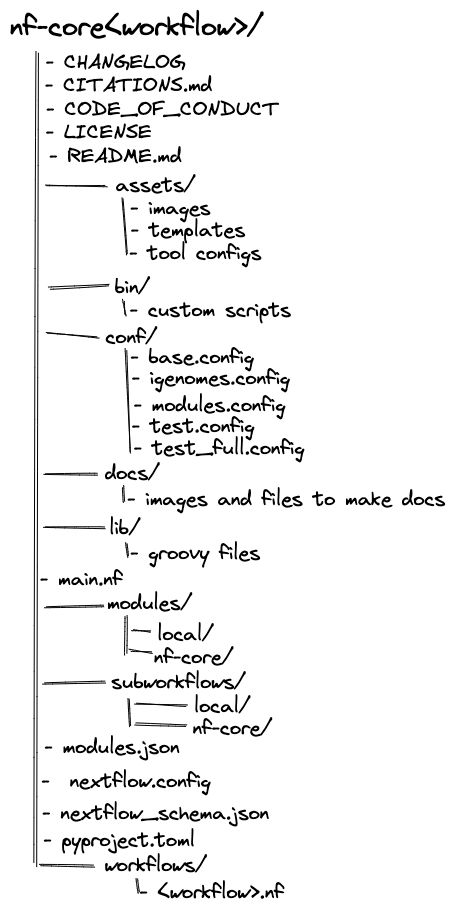

nf-core pipelines follow a set of best practices and standardized conventions. The structure of an nf-core pipeline is designed to be modular, easily customizable, and reproducible. Although you won’t need to edit the code base to run an nf-core pipeline, having a basic understanding of the repository structure will help you understand how to configure its execution.

# nf-core pipeline structure

nf-core pipelines start from a common template and follow the same structure. 



# Configuration

When a pipeline script is launched, Nextflow will look for configuration files in multiple locations. As each configuration file can contain conflicting settings, the sources are ranked to decide which settings to are applied.

Configuration sources are reported below and listed in order of priority:

1. Parameters specified on the command line (`--something value`)
2. Parameters provided using the `-params-file` option
3. Config file specified using the `-c my_config` option
4. The config file named `nextflow.config` in the current directory
5. The config file named `nextflow.config` in the workflow project directory
6. The config file `$HOME/.nextflow/config`
7. Values defined within the pipeline script itself (e.g., `main.nf`)

::: callout-warning
A `--params-file` must be used to define parameters.

Parameters defined in the parameter block in `custom.config` files **WILL NOT** override defaults in `nextflow.config` for nf-core pipelines.

:::

# `nextflow.config`

For nf-core pipelines, the `nextflow.config` contains parameter defaults. Inside the `nextflow.`config several `includeConfig` statements are used to include additional `.config` files from the `conf/` folder.

- `base.config`
  - Generous resource allocations using labels.
- `igenomes.config`
  - Default configuration to assess AWS iGenomes.
- `modules.config`
  - Module-specific configuration options (both mandatory or optional).
- `test.config`
  - A configuration to test the pipeline with a small test dataset
- `test_full.config`
  - A configuration to test the pipeline with a full-size test dataset.

# Config profiles

Configuration files can also contain the definition of one or more profiles. A profile is a set of configuration attributes that can be activated when launching a pipeline by using the `-profile` command line option.

Configuration profiles are defined by using the special scope `profiles` which group the attributes that belong to the same profile using a common prefix. For example, profiles defined in you your `nextflow.config` might like like:

```bash
profiles {

    standard {
        process.executor = 'local'
    }

    cluster {
        process.executor = 'sge'
        process.queue = 'long'
        process.memory = '10GB'
    }

}
```

```bash
nextflow run <your script> -profile standard
```

Additionally, `includeConfig` are used to access custom institutional profiles for different institutions that have been submitted to the nf-core repository on GitHub.

MORE INFO + LINK
