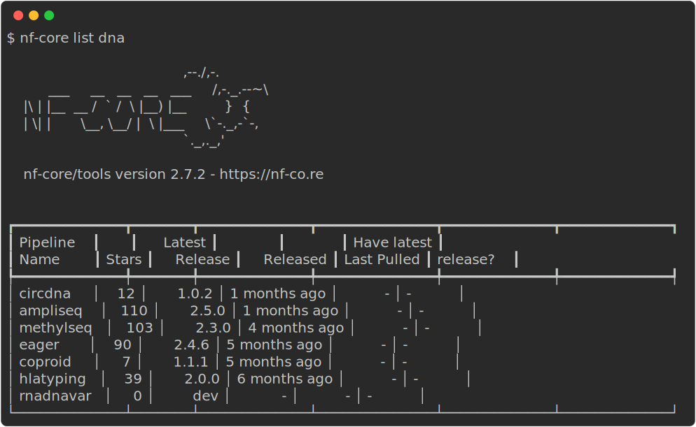
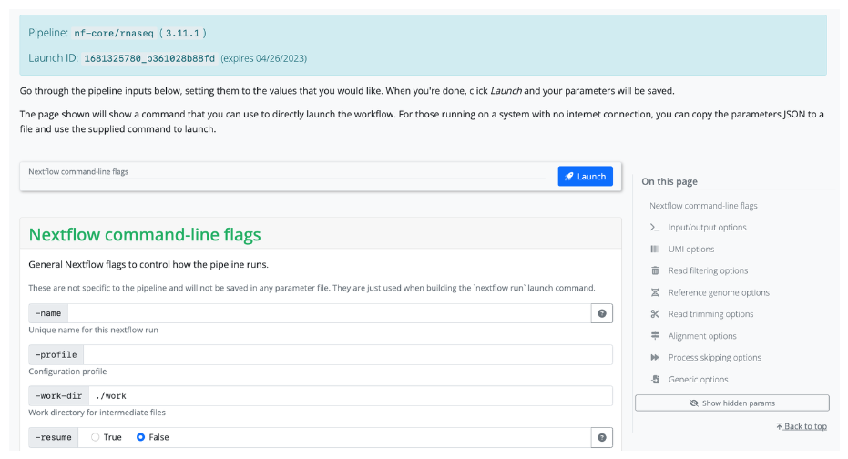

::: callout-tip

### Objectives{.unlisted}

- Learn more about nf-core tooling for users.
- Use `nf-core list` to view information about nf-core workflows.
- Use `nf-core launch` to create a parameters file.
- Use `nf-core download` to download a workflow and it's software.

:::

### **1.4.1 nf-core tools for users**

nf-core tools has additional commands to help **users** execute workflows. Although you do not need to use these commands to execute the nf-core workflows, they can greatly assist and improve and simplify your experience.

There are also nf-core tools for **developers**. However, these will not be covered as a part of this workshop. If you are curious to learn more about these tools you can find more information on the [tools page](https://nf-co.re/tools/) on the nf-core website.

### **1.4.2 `nf-core list`**

The nf-core `list` command can used to print a list of remote nf-core workflows along with your local information.

```bash
nf-core list
```

{width=100%}

The output shows the latest workflow version number and when it was released. You will also be shown if and when a workflow was pulled locally and whether you have the latest version.

Keywords can be supplied to help filter the workflows based on matches in titles, descriptions, or topics:

```bash
nf-core list dna
```

{width=100%}

Options can also be used to sort the workflows by latest release (`-s release`, default), when you last pulled a workflow locally (`-s pulled`), alphabetically (`-s name`), or number by the number of GitHub stars (`-s stars`).

::: callout-tip

### **Challenge**{.unlisted}

Filter the list of nf-core workflows for those that are for `rna` and sort them by stars.

:::

::: {.callout-caution collapse="true"}

### Solution

Execute the `list` command, filter it for `rna`, and sort by `stars`:

```bash
nf-core list rna -s stars
```

:::

### **1.4.2 `nf-core launch`**

Nextflow workflows can have a considerable number of optional command line flags. To help manage these, you can use the `nf-core launch` command.

The command takes one argument - either the name of an nf-core workflow which will be pulled automatically or the path to a directory containing a Nextflow workflow:

```bash
nf-core launch nf-core/<workflow>
```

When running this command, you will first be asked about which version of a workflow you would like to execute. Next, you will be given the choice between a web-based graphical interface or an interactive command-line wizard tool to enter the workflow parameters for your execute. Both interfaces show documentation alongside each parameter, will generate a run ID, and will validate your inputs.

{width=100%}

The `launch` tool uses the `nextflow_schema.json` file from a workflow to give parameter descriptions, defaults, and grouping. If no file for the workflow is found, one will be automatically generated at runtime.

The `launch` tool will save your parameter variables as a JSON file called `nf-params.json` and will suggest an execution command that includes the `-params-file` flag and your new `nf-params.json` file.

The wizard will ask if you want to launch the Nextflow run. You will also be given the `run` command and a copy of the JSON file for you to copy and paste if you wish.

Any profiles or Nextflow options that are set using the wizard will also be included in your `run` command.

::: callout-tip

### **Challenge**{.unlisted}

Execute the nf-core/rnaseq workflow with the nf-core `launch` command. Use the latest version of the workflow with the the `test` and `singularity` profiles, and name your output directory `results`:

:::

::: {.callout-caution collapse="true"}

### Solution

Use the nf-core `launch` command for the `nf-core/rnaseq` workflow and follow the prompts:

```bash
nf-core launch nf-core/rnaseq
```

Your final `run` command should look like this:

```bash
nextflow run nf-core/rnaseq -r 3.11.1 -profile test,singularity -params-file nf-params.json
```

Your `nf-params.json` file should look like this:

```bash
{
    "outdir": "results"
}
```

:::

### **1.4.3 nf-core download**

Sometimes you may need to execute an nf-core workflow on a server or HPC system that has no internet connection. In this case, you will need to fetch the workflow files and manually transfer them to your system.

To make this process easier and ensure accurate retrieval of correctly versioned code and software containers, nf-core has the `download` helper tool.

The nf-core `download` command will download both the workflow code and the institutional nf-core/configs files. It can also optionally download singularity image file.

```bash
nf-core download
```

If run without any arguments, the download tool will interactively prompt you for the required information. Each prompt option has a flag and if all flags are supplied then it will run without a request for any additional user input:

- **Pipeline name**
  - Name of workflow you would like to download.
- **Pipeline revision**
  - Select the revision you would like to download.
- **Pull containers**
  - Choose if you would like to download Singularity images.
  - This will only work if you have Singularity installed.
- **Choose compression type**
  - Choose compression type for Singularity images.

::: {.callout-note}

### **Key points**

- Point 1
- Point 2
- Point 3

:::
