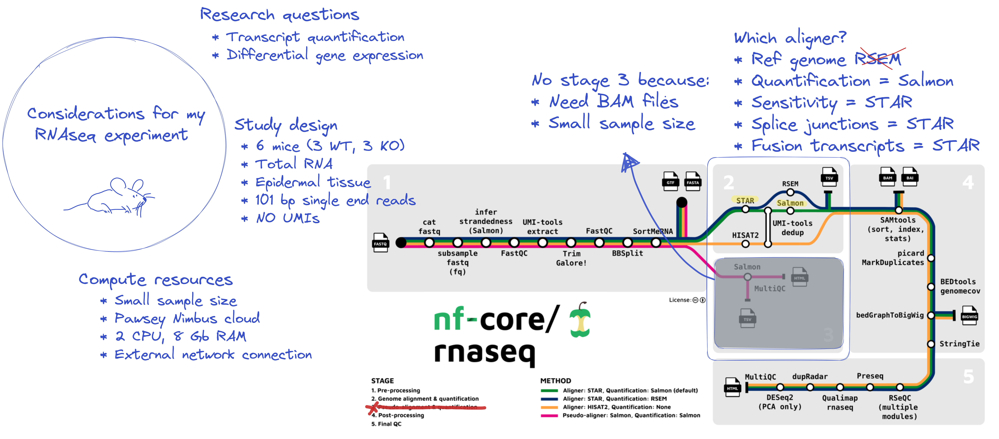

In this session we will be writing, running, adjusting, and rerunning the nf-core/rnaseq workflow run command as we step through various customisation scenarios. While all activities in this session will be performed using the nf-core/rnaseq workflow, all customisation scenarios we explore are applicable to other nf-core workflows and do not require an understanding of rnaseq data processing.

### **Things to keep in mind**{.unlisted}

Before starting this session, we should discuss some important considerations and recommendations to keep in mind as you proceed through the lessons and apply these techniques to your own research. As with all open source bioinformatics resources, nf-core workflows may not suit all applications. It is important that you understand the needs of your dataset and research questions before deciding on a workflow.



### **Log back in to your instance**{.unlisted}

#### **In Visual Studio Code**

Same as yesterday, connect to your instance using the command palatte:

- `Ctrl`+`Shift`+`P` to open command palette
- Select `Remote-SSH: Connect to Host` and select name of your host
- Select `Linux` from dropdown menu and then `continue`

Having successfully logged in, you should see a small green box in the bottom left corner of your screen:


#### **In a terminal**

With a terminal application, run the following on the command-line:

```default
ssh training@###.###.###.###
```

Enter the password provided at the beginning of the workshop. Ask one of the demonstrators if you’ve forgotten it.

```default
Enter password:
```

Having successfully logged in, your terminal should then display something like that shown in the figure below:


<div class="keypoints">

### **Key points**{.unlisted}

-

</div>
