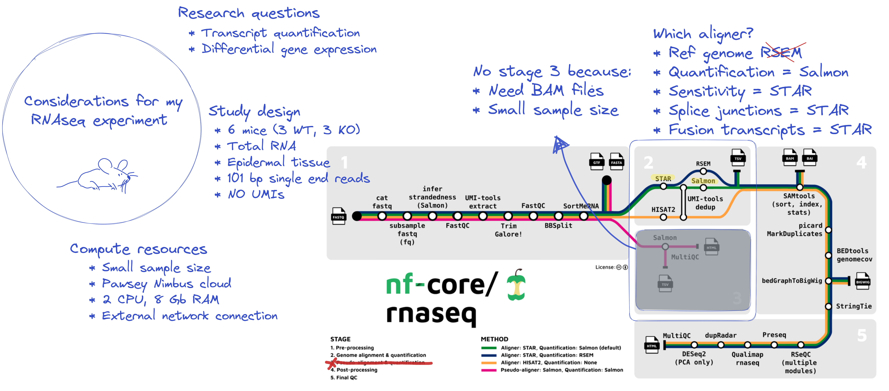

In this session we will be **writing, running, adjusting, and re-running the nf-core/rnaseq workflow as we step through various customisation scenarios**. While all activities in this session will be performed using the nf-core/rnaseq workflow, all customisation scenarios we explore are applicable to (most) other nf-core workflows and do not require an understanding of rnaseq data processing. Before starting this session, there are a few things you should keep in mind as you proceed through the lessons and apply these techniques to your own research. 

As with all open source bioinformatics resources, nf-core workflows may not suit all applications. It is important that you **understand the needs of your dataset and research questions before deciding on a workflow**. All nf-core workflows are provided with sensible default settings that have broad applicability and comprensive documentation that explains all available parameters. What is 'sensible' varies dramatically between different experiments, computing environments, and datasets, so these settings might not suit your needs.  

### **Introducing the case study**{.unlisted}

For the purposes of this session, we are working with a (subset) dataset from a knockout mouse model study by [Corley et al. (2016)](https://bmcgenomics.biomedcentral.com/articles/10.1186/s12864-016-2801-4). The authors used the mouse model to simulate the role of a specific gene (*Gtf2ird1*) in Williams-Beuren Syndrome (WBS), a rare genetic disease in people. Today, we are performing the pre-processing steps in a slightly different way from the authors, to generate a set of files that can be analysed downstream. In deciding whether or not the nf-core/rnaseq workflow was suitable for reproducing the results presented in this study, we considered a number of factors, including: 

|**Consideration**      |**Questions to ask of our experiment**                             |**Why**                                                                       |
|-----------------------|-------------------------------------------------------------------|------------------------------------------------------------------------------|
|**Size of dataset**        |Number of samples and data volume                                  |Scale of data impacts computational efficiency of the workflow                |
|**Input data**             |Type of RNA sequenced, availability of reference files             |Determines if we meet input requirements of workflow                          |
|**Research questions**     |Suitability of workflow outputs                                    |Need the right processed data for downstream analysis                         |
|**Computational resources**|CPU, memory, RAM available and minimum requirements of the workflow|Determines if I have enough resources to run the workflow                     |
|**Tool preferences**       |Suitability of each tool, required inputs and outputs              |Workflow offers multiple tools for some steps, determines which choices I make|

We consulted the [nf-core/rnaseq documentation](https://nf-co.re/rnaseq) to confirm that nf-core/rnaseq is a suitable workflow for our application. W've sketched out our experimental design, those considerations, and our choices below. We will discuss these further, shortly. 



### **Log back in to your instance**{.unlisted}

#### **In Visual Studio Code** 

Same as yesterday, connect to your instance using the command palatte:

  * `Ctrl`+`Shift`+`P` to open command palette 
  * Select `Remote-SSH: Connect to Host` and select name of your host
  * Select `Linux` from dropdown menu and then `continue` 

Having successfully logged in, you should see a small green box in the bottom left corner of your screen:


#### **In a terminal** 
With a terminal application, run the following on the command-line: 
 ```default
 ssh training@###.###.###.###
 ```
Enter the password provided at the beginning of the workshop. Ask one of the demonstrators if you’ve forgotten it.
```default
Enter password:
```

Having successfully logged in, your terminal should then display something like that shown in the figure below:


::: {.callout-note}
### **Key points**
- nf-core workflows are provided with sensible defaults. These may not always suit your needs. 
- To decide whether an nf-core workflow is the right choice for your experiment you need to understand the needs of your dataset and research questions.
- Use the workflow documentation to understand the requirements for running a workflow. 
:::
