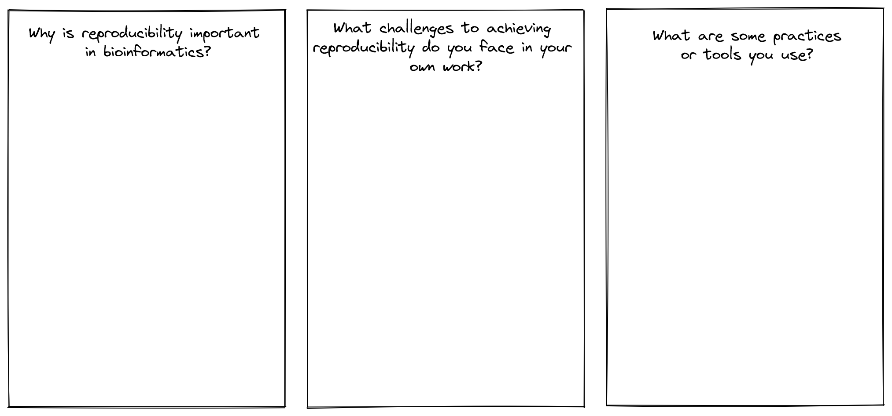

<div class="objectives">
  
### Objectives{.unlisted}

- Use the nf-core documentation to select appropriate parameters for a run command 
- Write and run a nf-core rnaseq command on the command line 
- Explore workflow deployment and set up 

</div>

### **Download the workflow code**{.unlisted}

It can be very easy to lose track while working on the command line, especially when we're working with large datasets and complex commands as we do with bioinformatics workflows. To make sure we work reproducibly, we will be organising our workspace and using a local copy of the [nf-core/rnaseq](https://nf-co.re/rnaseq) workflow for all exercises. 

Start by creating a new directory for all of today's activities and move into it: 

```bash
mkdir ~/nfcore-workshop/session2 && cd $_
```

There are a number of ways to download a nf-core workflow to your machine. We recommend using git or nf-core tools. To download the workflow using the nf-core tools utility, read and follow directions [here](https://nf-co.re/tools/) and complete the following exercise: 

<div class="challenge">

### **Challenge**{.unlisted}

What command would you run to find and download a local copy of the nf-core/rnaseq v3.10.1 workflow without downloading any containers using the nf-core tools utility? 

<details>
<summary>Solution</summary>

Search for the rnaseq pipeline: 
```bash
nf-core list rnaseq
```

Then, download the correct pipeline: 
```bash
nf-core download nf-core/rnaseq
```

You will be prompted to select a version. Use your arrow keys to specify 3.10.1 and hit enter. 

```bash
ubuntu@georgiedev:~$ nf-core download nf-core/rnaseq

                                          ,--./,-.
          ___     __   __   __   ___     /,-._.--~\
    |\ | |__  __ /  ` /  \ |__) |__         }  {
    | \| |       \__, \__/ |  \ |___     \`-._,-`-,
                                          `._,._,'

    nf-core/tools version 2.7.2 - https://nf-co.re


? Select release / branch: 3.10.1  [release]

In addition to the pipeline code, this tool can download software containers.
? Download software container images: none

If transferring the downloaded files to another system, it can be convenient to have everything compressed in a single file.
? Choose compression type: none
INFO     Saving 'nf-core/rnaseq'                                                                                            
          Pipeline revision: '3.10.1'                                                                                       
          Pull containers: 'none'                                                                                           
          Output directory: 'nf-core-rnaseq-3.10.1'                                                                         
INFO     Downloading workflow files from GitHub                                                                             
INFO     Downloading centralised configs from GitHub 
```

Check the workflow has been downloaded: 
```bash
ls
```

</details>
</div>  

Alternatively, to download the most recent version of the workflow from it's [GitHub repository](https://github.com/nf-core/rnaseq) with git, run: 

```bash
git clone https://github.com/nf-core/rnaseq.git
```

:::{.callout-warning}
## Zoom reaction check in!
**Is everyone ok?**   
:clap: (clap) yes, lets move on.  
:cry: (cry) no, please help. 
:::

### **Building your run command**{.unlisted}

All nf-core workflows are provided with sensible default settings that have broad applicability and comprensive documentation that explains all available parameters. What is 'sensible' varies dramatically between different experiments, computing environments, and datasets, so these settings might not suit your needs. For this workshop, consider the experimental design below: 

* We won't run the pseudo alignment step 
* We have chosen to use **STAR** to align reads 
* We have chosen to use **Salmon** to estimate transcript abundance
* We only have access to **2 CPUs and 8Gb** of RAM today 
* We are working with our own subset data today (including reference data)


<div class="challenge">

### **Challenge**{.unlisted}

Using the [nf-core/rnaseq documentation](https://nf-co.re/rnaseq/3.10.1/parameters) and the diagram above, can you decide which flags you may need to add to this command for this experiment?  
```default
nextflow run nf-core-rnaseq-3.10.1/workflow/main.nf \
  --input <samples.tsv> \
  -profile singularity \
  -with-report execution_report_exercise2_1.html \
  -with-trace execution_trace_exercise2_1.txt \
  -with-timeline timeline_exercise2_1.html \
  -with-dag dag_exercise2_1.png
```

HINT: You will need to look at the [reference genome](https://nf-co.re/rnaseq/3.10.1/parameters#reference-genome-options), [alignment](https://nf-co.re/rnaseq/3.10.1/parameters#alignment-options), and [max job request](https://nf-co.re/rnaseq/3.10.1/parameters#max-job-request-options) options. 

<details>
<summary>Solution</summary>

Given we are using STAR and Salmon as our aligner and quantification tool of choice (respectively) and it is the default choice of this workflow we will not need to provide an `--aligner` flag. However, if you wanted to provide this for the sake of reproducibility in case things change in the future: 
```default
--aligner 'star_salmon'
```

Given we are providing our own subset data for this workshop, we will need to use:
```default
--fasta /path/to/mouse.fa  
--gtf /path/to/mouse.gtf 
--star_index /path/to/STAR
```

Given we have limited computing resources today, we will need to specify a ceiling for both memory and CPUs:
```default
--max_memory '6.GB' 
--max_cpus 2 
```

</details>
</div>  

:::{.callout-warning}
## Zoom reaction check in!
**Is everyone ok?**   
:clap: (clap) yes, lets move on.  
:cry: (cry) no, please help. 
:::

### **Run the workflow**{.unlisted}

Make a new working directory for this lesson and move into it: 
```default
mkdir ~/nfcore-workshop/session2/exercise1 && cd $_
```

For the sake of expediency, we are using prepared subset data for this session. All the data (including fastqs, input manifest, reference fasta, gtf, and STAR indexes) are available on the CernVM-FS file system. CernVM-FS is a read-only file system that Pawsey have used to store files such as containerised tools ([Biocontainers](https://biocontainers.pro/)), reference datasets, and other shared resources that are commonly used by many researchers. Take a look [here](https://support.pawsey.org.au/documentation/display/US/Nimbus+for+Bioinformatics) for more information on bioinformatics resources provided by Pawsey on Nimbus. 

Take a quick look at the workshop data we're working with today: 

```default
ls /path/to/aarnet-cvmfs/training/workshopMaterials
```

We need to store this path in a variable for our run command:
```default
materials=/path/to/aarnet-cvmfs/training/workshopMaterials
```

Now run the workflow: 

```default
nextflow run nf-core-rnaseq-3.10.1/workflow/main.nf \
  --input $materials/samples.tsv \
  -profile singularity \
  --fasta $materials/mm10_chr18.fa \
  --gtf $materials/mm10_chr18.gtf \
  --star_index $materials/STAR \
  --max_memory '6 GB' --max_cpus 2 \
  --outdir ex1_results \
  -with-report execution_report_exercise2_1.html \
  -with-trace execution_trace_exercise2_1.txt \
  -with-timeline timeline_exercise2_1.html \
  -with-dag dag_exercise2_1.png
```

### **Reproducibility is a state of mind**{.unlisted}

We have to wait for the workflow to run (this should take ~20 mins) before we can get on with the other exercises. While we wait, lets discuss how we manage reproducibility in our own practices, and share some useful resources with one another:  



<div class="keypoints">

### **Key points**{.unlisted}

* 

</div>  

