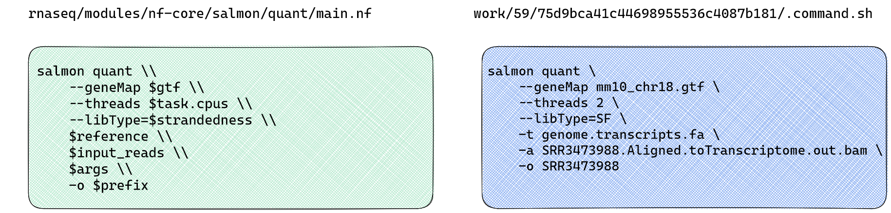

::: callout-tip
### Objectives{.unlisted}

- Write a parameter file
- Understand the YAML file format 
- Rerun the workflow using a params file 
- Understand the use of the params file for reproducible and transparent research
:::

In Nextflow, parameters are values that can be set by the user and used to control the behaviour of a workflow or process within the workflow. Parameters are used in nf-core workflows to specify input and output files and define other aspects of workflow execution. Each nf-core workflow comes with a default set of parameters that can be customised to suit specific requirements. In the previous lesson we supplied these parameters in our run command, on the command line. Specifying multiple parameters like this can be messy and hard to keep track of. 

Nextflow allows us to pass all parameters to a workflow's run command using the `-params-file` flag and a JSON or YAML file. Using a parameter file makes it easier to rerun and reproduce our code, we can also share these files with our collaborators and provide as supplementary file in a publication. In this lesson we're going to adjust our run command and rerun the workflow using a parameter file, rather than specifying all parameters on the command line.  

### **Revisit the strandedness issue**

While our workflow completed successfully, all fastq files failed the strandedness check:

```default
[nf-core/rnaseq] Pipeline completed successfully with skipped sampl(es)-
[nf-core/rnaseq] Please check MultiQC report: 6/6 samples failed strandedness check.-
Completed at: 11-Apr-2023 01:01:54
Duration    : 17m 4s
CPU hours   : 0.3
Succeeded   : 200
```
Let's take a look at the MultiQC report, as directed. You can find this report in the `results/` directory: 
```default
ls results/multiqc/star_salmon
```
```default
total 1468
drwxrwxr-x 4 ubuntu ubuntu    4096 Apr 11 01:01 .
drwxrwxr-x 3 ubuntu ubuntu    4096 Apr 11 01:01 ..
drwxrwxr-x 2 ubuntu ubuntu    4096 Apr 11 01:01 multiqc_data
drwxrwxr-x 5 ubuntu ubuntu    4096 Apr 11 01:01 multiqc_plots
-rw-rw-r-- 1 ubuntu ubuntu 1483384 Apr 11 01:01 multiqc_report.html
```

Open the `multiqc_report.html` the file navigator panel on the left side of your VS code window by clicking on it. Then open the rendered html file using the Live Server extension:

1. `Ctrl`+`Shift`+`P` to open the command palette 
2. Select `Live Server: Open with Live Server` to open html file in your browser window.

Take a look a the section labelled **WARNING: Fail Strand Check**


The issue here is **provided strandedness** that we specified in our `samplesheet.csv` and **inferred strandedness** do not match. Look's like we've incorrectly specified strandedness as forward, when our reads show an equal distribution of sense and antisense reads. 

#### **How can we know what tool flags are applied by default?**

It can be challenging to troubleshoot nf-core workflows because of the scale and structure of the workflow code. To understand what command is being run for a process, you can attempt to infer this information from a process `main.nf` script in the `modules/` directory. However, given all the different parameters that may be applied, this may not be straight forward. To understand what Salmon is doing, we're going to use the `nextflow log` command and some custom bash code to track down the hidden `.command.sh` scripts for each Salmon quant process.  

Use the [Nextflow log](https://www.nextflow.io/docs/latest/tracing.html#execution-log) command to reveal information about executed pipelines in our working directory: 

```default
nextflow log
```
This will print a list of executed pipelines, by default: 

```default 
TIMESTAMP               DURATION        RUN NAME                STATUS  REVISION ID     SESSION ID                              COMMAND 
2023-04-11 00:44:49     17m 5s          golden_yonath           OK      f421ddc35d      db6b8373-5e27-4a79-bf9b-6c56cda4bb6c    nextflow run rnaseq/main.nf --input /home/ubuntu/session2/materials/samplesheet.csv -profile singularity --fasta /home/ubuntu/session2/materials/mm10_reference/mm10_chr18.fa --gtf /home/ubuntu/session2/materials/mm10_reference/mm10_chr18.gtf --star_index /home/ubuntu/session2/materials/mm10_reference/STAR --max_memory '6 GB' --max_cpus 2 --outdir Exercise_1
```

All recent runs will be listed, with the most recent last (i.e. closest to your returned command prompt). Let's query the logs for the previous lesson run. Run the command below after filling in your unique run name. For example: 

```default
nextflow log golden_yonath
```

That command listed out all the work sub-directories for all processes run.  Recall that the actual tool commands issued by the nexflow processes are all recorded in hidden script files called `.command.sh` within the execution process directory. One way of observing the actual run commands issued by the workflow is to view these comamnd scripts. But how to find them?! Let's add some custom bash code to query a Nextflow run with the run name from the previous lesson.  

First, save your run name in a bash variable:
```default
run_name=<ENTER_YOUR_RUN_NAME>
```

And let's save the tool of interest (salmon) in another bash variable:
```default
tool=salmon
```

Next, run the following bash command:
```default
nextflow log ${run_name} | while read line;
    do
    cmd=$(ls ${line}/.command.sh 2>/dev/null);     \
      if grep -q $tool $cmd;     \
      then  
        echo $cmd;     
      fi; 
    done 
```

That will list all process `.command.sh` scripts containing 'salmon'. There are multiple salmon steps in the workflow, inlcuding index and an R script. We are looking for salmon quant which performs the read quantification. 

```default
/home/ubuntu/session2/work/cb/6959bb97e93a5e433d690233cab9f9/.command.sh
/home/ubuntu/session2/work/cf/bebfb9626bd3cde6d9f56dd952c5dd/.command.sh
/home/ubuntu/session2/work/73/345d1d9b74f2b955a07f26f1d8e307/.command.sh
/home/ubuntu/session2/work/f2/5c28c327f6d7df4d0b89db419cf833/.command.sh
/home/ubuntu/session2/work/cb/50978a7c19becbdd5e3cc2099ca9b8/.command.sh
/home/ubuntu/session2/work/c5/66c98171bb83bae482652ad8937e9b/.command.sh
/home/ubuntu/session2/work/23/b88d62b3bf462930a227d1372dd664/.command.sh
/home/ubuntu/session2/work/99/6ea0e9670dfea9ded434badcc731a9/.command.sh
/home/ubuntu/session2/work/c4/d5eeca5174a0d6a6c5c8a677265c30/.command.sh
/home/ubuntu/session2/work/92/02fab5c1de54025e6189a06017c371/.command.sh
/home/ubuntu/session2/work/44/fbf4d28bc12e33fe1a7fe44116e2cb/.command.sh
/home/ubuntu/session2/work/3a/d50a08afc9328aacae246b2a05f267/.command.sh
/home/ubuntu/session2/work/59/75d9bca41c44698955536c4087b181/.command.sh
```

Compared with the salmon quant `main.nf` file, we get more information from the `.command.sh` process scripts: 



Looking at the nf-core/rnaseq documentation, we can see library type is automatically inferred based on provided strandedness and this can be overridden using the `--libType=$strandedness` [parameter](https://nf-co.re/rnaseq/3.11.1/parameters#salmon_quant_libtype). Following the recommendations in the [Salmon documentation](https://salmon.readthedocs.io/en/latest/salmon.html#what-s-this-libtype), we're going to override this default with `--salmon_quant_libtype A`. 

::: {.callout-note}
### **Automatic library type detection with Salmon**
Salmon is a tool for transcript quantification using RNA-seq data. Library type is important for transcript quantification as it determines how reads are aligned to the reference transcriptome, how expression levels are estimated. Salmon can accurately determine library type based on alignment files. To avoid potential input errors in future runs, we'll allow Salmon to automatically detect the library type. You can read more about how Salmon performs library detection [here](https://salmon.readthedocs.io/en/latest/salmon.html#what-s-this-libtype). 
:::

### **Writing a parameter file**

Nextflow accepts either YAML or JSON formats for parameter files. YAML and JSON are data ways of storing data objects and structures in a file and either is a valid choice for building your parameters file. We will create and apply a YAML file with our inputs for our second run, because its easier to read. YAML files use a `.yml` and `.yaml` extension and follow these syntax rules: 

* Uses 3 dashes (-\-\-) to indicate the start of a document and 3 dots (...) to indicate the end
* Uses an indentation heirarchy like Python to show a heirarchy in the data 
* Key/value pairs are separated by a colon (:) 
* Lists begin with a hyphen 
* Each key and value must be unique
* The order of keys or values in a list doesn't matter

::: callout-tip
### **Challenge**{.unlisted}

Using the syntax rules above: 

1. Write a YAML file for the parameters run command that can be run by a collaborator working on a **different computational infrastructure** but the **same input and reference files**
2. Add a key for the `--salmon_quant_libtype A` flag, we have added to the workflow

```default
nextflow run rnaseq/main.nf \
    --input $materials/samplesheet.csv \
    -profile singularity \
    --fasta $materials/mm10_reference/mm10_chr18.fa \
    --gtf $materials/mm10_reference/mm10_chr18.gtf \
    --star_index $materials/mm10_reference/STAR \
    --max_memory '6 GB' \
    --max_cpus 2 
    --outdir Exercise1
```
:::

::: {.callout-caution collapse="true"}
### Solution

Save this file as `params.yaml`:

```yaml
# experiment: WT vs KO mouse model
# workflow: nf-core/rnaseq/3.11.1 
---
input: "/home/ubuntu/session2/materials/samplesheet.csv" 
outdir: "Exercise2"
gtf: "/home/ubuntu/session2/materials/mm10_reference/mm10_chr18.gtf"
fasta: "/home/ubuntu/session2/materials/mm10_reference/mm10_chr18.fa"
star_index: "/home/ubuntu/session2/materials/mm10_reference/STAR" 
salmon_quant_libtype : A
...
```
:::

Any of the workflow [parameters](https://nf-co.re/rnaseq/3.11.1/parameters) can be added to the parameters file in this way.

### **Passing an input parameter file**

Once your params file has been saved, run the following, observing how the command is now shorter thanks to offloading some parameters to the params file. Note the use of a single - for 'resume' and 'params-file' as these are Nextflow flags and not nf-core parmeters. Nextflow can use cached output! If we apply the `-resume` flag to the run, Nextflow will only compute what has not been changed. Rerun the workflow:

```default
nextflow run rnaseq/main.nf \
  --max_memory 6.GB \
  --max_cpus 2 \
  -profile singularity \
  -resume \
  -params-file params.yaml                                            
```

As we've used the `-resume` flag, the initial pre-processing stage and STAR alignments should to be restored from cache and the Salmon steps to be recomputed. 

::: {.callout-note}
### **Key points**
- A parameter file can be used to 
- 2 
:::

